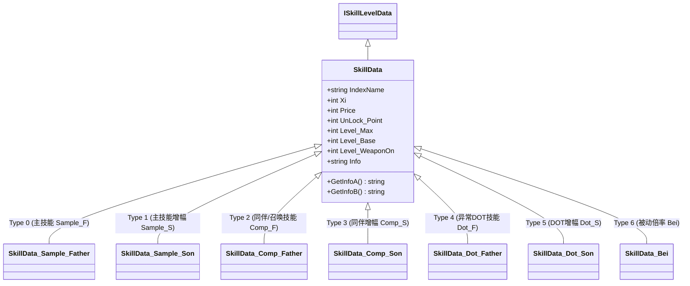

# 《暗影地牢》(Shadow Dungeon) 技能体系全解与技术参考

> 本文档系统梳理《暗影地牢》反编译工程（Unity 2019.4.39f1 Mono 后端，895 个 .cs 文件）中完整的**技能体系**。覆盖玩家 70 个主动主技能（Sample_F）、13 个同伴/召唤技能（Comp_F）、12 个全局异常状态/DOT技能（Dot_F）、36 个被动倍率技能（Bei）、180 个主技能增幅子节点（Sample_S）、39 个同伴增幅子节点（Comp_S）、48 个 DOT 增幅子节点（Dot_S）、50 个巅峰天赋（DF）及技能演化（SKC/CPC）体系。

## 一、技能体系架构与运转机制

### 1. 施法主链路 (Primary Casting Chain)
游戏内主动施法走严格的**输入分流 -> 动画事件触发 -> 投射物组装 -> 物理碰撞与伤害结算**四段主链路：
1. **输入与门控分流**：玩家按下快捷键（Skill 1~8）触发 [`PlayerActionManager.TryUseSkillDown`](file:///C:/GAME-AnYingDiLao/MODworkv2/decompiled/Entity.Character.Player/PlayerActionManager.cs)。该方法校验玩家存活状态、CD 冷却与当前法力值（`ManaStat.Cur >= ManaCost`）。校验通过后调用 [`UseSkill`](file:///C:/GAME-AnYingDiLao/MODworkv2/decompiled/Entity.Character.Player/PlayerActionManager.cs)：
   - **主技能（Type 0, SP）**：设置 `_playerManager.IScomp = false`，记录当前施法槽位 `_playerManager.CurUseSK`，调用 `_playerManager.PlayerSP(UseAni)` 播放角色对应 Spine 施法动画。
   - **同伴技能（Type 1, CP）**：设置 `_playerManager.IScomp = true`，调用 `_playerManager.PlayerCP(UseAni)` 播放召唤 Spine 动画。
2. **Spine 动画事件回调**：Spine 施法动画播放至命中/出膛关键帧时，触发各武器类型的监听组件：
   - 法杖武器：[`MGC.cs`](file:///C:/GAME-AnYingDiLao/MODworkv2/decompiled/MGC.cs) -> 调用 [`Gun.MGCattack`](file:///C:/GAME-AnYingDiLao/MODworkv2/decompiled/Gun.cs)
   - 剑盾武器：[`SQS.cs`](file:///C:/GAME-AnYingDiLao/MODworkv2/decompiled/SQS.cs) -> 调用 [`Gun.SQSattack`](file:///C:/GAME-AnYingDiLao/MODworkv2/decompiled/Gun.cs)
   - 弓弩武器：[`ARC.cs`](file:///C:/GAME-AnYingDiLao/MODworkv2/decompiled/ARC.cs) -> 调用 [`Gun.ARCattack`](file:///C:/GAME-AnYingDiLao/MODworkv2/decompiled/Gun.cs)
   - 死灵/镰刀：[`DEAD.cs`](file:///C:/GAME-AnYingDiLao/MODworkv2/decompiled/DEAD.cs) -> 调用 [`Gun.DEADattack`](file:///C:/GAME-AnYingDiLao/MODworkv2/decompiled/Gun.cs)
3. **弹体与召唤实体组装**：
   - **主技能**：[`Gun.CreatSP`](file:///C:/GAME-AnYingDiLao/MODworkv2/decompiled/Gun.cs) 从对象池（`LeanPool`）实例化投射物预制体，填充 [`SkillOBJ_DT_SP`](file:///C:/GAME-AnYingDiLao/MODworkv2/decompiled/SkillOBJ_DT_SP.cs) 运行时参数包，根据 `FStype` 启动飞行、爆炸、追踪、落点或环绕行为。
   - **同伴召唤**：[`Gun.CreatCP`](file:///C:/GAME-AnYingDiLao/MODworkv2/decompiled/Gun.cs) 实例化 `CP_OBJ` 召唤发射器，填充 [`CompanionRuntimeData`](file:///C:/GAME-AnYingDiLao/MODworkv2/decompiled/Data.RuntimeData.Skills.CompSkill/CompanionRuntimeData.cs) 快照，经 [`SK_FSQ_comp.Init`](file:///C:/GAME-AnYingDiLao/MODworkv2/decompiled/SK_FSQ_comp.cs) 生成 [`Companion`](file:///C:/GAME-AnYingDiLao/MODworkv2/decompiled/Companion.cs) 实体并激活 [`CompanionBrain`](file:///C:/GAME-AnYingDiLao/MODworkv2/decompiled/CompanionBrain.cs) AI 状态机。
4. **物理碰撞与伤害结算**：弹体经 2D 碰撞器（`OnTriggerEnter2D`）或范围检测触发伤害结算，结算暴击（`BJrate`/`BJDamage`）、穿透（`Through`）、移速削减（`MoveSpeedCut`）以及同系 DOT 附着（[`DOT_MG`](file:///C:/GAME-AnYingDiLao/MODworkv2/decompiled/DOT_MG.cs) / [`DotEM`](file:///C:/GAME-AnYingDiLao/MODworkv2/decompiled/DotEM.cs)）。

### 2. 类继承结构与分类契约
所有技能节点均继承自抽象基类 [`SkillData`](file:///C:/GAME-AnYingDiLao/MODworkv2/decompiled/SkillData.cs) 并实现 [`ISkillLevelData`](file:///C:/GAME-AnYingDiLao/MODworkv2/decompiled/UI.Talent/ISkillLevelData.cs) 契约：

### 3. 数值动态联动与天赋装填规则
- **只读属性动态联动**：`SkillData_Sample_Father` 中的 `Damage_Last`、`ManaCost_Last`、`CoolDown_Last` 等均为只读计算属性，通过 `Damage_Base + Damage_Level * (Level_Base_Last - 1) + TalentManager.Instance.GetDamage(...)` 实时汇聚基础数值与天赋加成。
- **快捷栏装填 (Action Bar)**：在天赋树加点（`Level_Base > 0`）后，[`TalentManager`](file:///C:/GAME-AnYingDiLao/MODworkv2/decompiled/TalentManager.cs) 触发 [`ACTbar.AddSkillListSlotSP`](file:///C:/GAME-AnYingDiLao/MODworkv2/decompiled/ACTbar.cs) / [`AddSkillListSlotCP`](file:///C:/GAME-AnYingDiLao/MODworkv2/decompiled/ACTbar.cs)，将技能封装为 [`ACT_skillData`](file:///C:/GAME-AnYingDiLao/MODworkv2/decompiled/ACT_skillData.cs) 并注册到可选列表，玩家可将其分配至 8 个快捷施法栏（`skillBT[0..7]`）。
- **DOT 元素级共享**：点出某元素系的 [`SkillData_Dot_Father`](file:///C:/GAME-AnYingDiLao/MODworkv2/decompiled/SkillData_Dot_Father.cs) 后，[`ACTbar.SetDot`](file:///C:/GAME-AnYingDiLao/MODworkv2/decompiled/ACTbar.cs) 激活该系 DOT。同系同元素属性的所有主技能与同伴攻击均享有点燃/霜冻/导电/流血/中毒/枯萎的触发几率。

## 二、表格一：主技能 (Primary Skills, Sample_F)

> 共 **70 个主动主技能**，分布在 12 个元素天赋系中。装填在快捷栏（SP 消耗体系），直接由玩家按键触发。包含完整的数值、弹道形态、天赋解锁要求及代码实现位置。

| 技能名 | 消耗 | 效果与关键数值 | 弹幕/形态 | 解锁/等级 | 代码位置 | 备注 |
|---|---|---|---|---|---|---|
| **火球术** *FireBall* | **2 SP** CD: 0s | **火焰属性** 伤害: **100%** (+30%/Lv) 描述: *发射一个火球* | 直射投射物 (OBJ:0) | **地狱使者** (Xi 0) 解锁: **0** 点 上限: **Lv.4** | [`Gun.CreatSP`](file:///C:/GAME-AnYingDiLao/MODworkv2/decompiled/Gun.cs) [`SK_FlyA.cs`](file:///C:/GAME-AnYingDiLao/MODworkv2/decompiled/SK_FlyA.cs) | 子节点: 爆裂(Explosion)、分裂火球(Split Fireball) |
| **地狱火** *Hellfire* | **6 SP** CD: 4s | **火焰属性** 伤害: **220%** (+44%/Lv) 描述: *在目标处生成一个持续燃烧的地狱火坑* | 地面目标区域法阵 (OBJ:1) | **地狱使者** (Xi 0) 解锁: **4** 点 上限: **Lv.4** | [`Gun.CreatSP`](file:///C:/GAME-AnYingDiLao/MODworkv2/decompiled/Gun.cs) [`SK_FSQ_fatherDIC.cs`](file:///C:/GAME-AnYingDiLao/MODworkv2/decompiled/SK_FSQ_fatherDIC.cs) / [`SK_DZ.cs`](file:///C:/GAME-AnYingDiLao/MODworkv2/decompiled/SK_DZ.cs) | 子节点: 过热(Overheat)、恶魔之火(Demon Fire) |
| **陨石** *Meteorite* | **10 SP** CD: 4s | **火焰属性** 伤害: **260%** (+52%/Lv) 描述: *巨大的陨石击中目标区域* | 地面目标区域法阵 (OBJ:2) | **地狱使者** (Xi 0) 解锁: **9** 点 上限: **Lv.4** | [`Gun.CreatSP`](file:///C:/GAME-AnYingDiLao/MODworkv2/decompiled/Gun.cs) [`SK_FSQ_fatherDIC.cs`](file:///C:/GAME-AnYingDiLao/MODworkv2/decompiled/SK_FSQ_fatherDIC.cs) / [`SK_DZ.cs`](file:///C:/GAME-AnYingDiLao/MODworkv2/decompiled/SK_DZ.cs) | 子节点: 滚烫(Scalding)、烈火献祭(Burning Sacrifice)、陨石爆裂(Meteor Explosion) |
| **烈焰风暴** *Flamestrike* | **15 SP** CD: 4s | **火焰属性** 伤害: **400%** (+80%/Lv) 描述: *引燃周围的空气，烧伤附近的敌人* | 自身环绕光环 (OBJ:3) | **地狱使者** (Xi 0) 解锁: **14** 点 上限: **Lv.4** | [`Gun.CreatSP`](file:///C:/GAME-AnYingDiLao/MODworkv2/decompiled/Gun.cs) [`SK_BuffA.cs`](file:///C:/GAME-AnYingDiLao/MODworkv2/decompiled/SK_BuffA.cs) | 子节点: 火焰削弱(Flame Weakening)、回响(Resonance) |
| **火山爆发** *Volcano* | **20 SP** CD: 8s | **火焰属性** 伤害: **400%** (+80%/Lv) 描述: *在目标处制造一个火山，喷射大量火球* | 地面目标区域法阵 (OBJ:4) | **地狱使者** (Xi 0) 解锁: **14** 点 上限: **Lv.4** | [`Gun.CreatSP`](file:///C:/GAME-AnYingDiLao/MODworkv2/decompiled/Gun.cs) [`SK_FSQ_fatherDIC.cs`](file:///C:/GAME-AnYingDiLao/MODworkv2/decompiled/SK_FSQ_fatherDIC.cs) / [`SK_DZ.cs`](file:///C:/GAME-AnYingDiLao/MODworkv2/decompiled/SK_DZ.cs) | 子节点: 地壳运动(Tectonic Movement)、预热(Preheat)、热浪(Heatwave) |
| **地狱爆弹** *Hell Bomb* | **30 SP** CD: 8s | **火焰属性** 伤害: **1300%** (+260%/Lv) 描述: *发射一个多次弹跳的爆炸火弹* | 扇形/散弹 (OBJ:5) | **地狱使者** (Xi 0) 解锁: **29** 点 上限: **Lv.3** | [`Gun.CreatSP`](file:///C:/GAME-AnYingDiLao/MODworkv2/decompiled/Gun.cs) [`SK_Angle_F.cs`](file:///C:/GAME-AnYingDiLao/MODworkv2/decompiled/SK_Angle_F.cs) / [`SK_FlyBall.cs`](file:///C:/GAME-AnYingDiLao/MODworkv2/decompiled/SK_FlyBall.cs) | 【终极(Last)】 子节点: 炼狱(Inferno)、爆裂射弹(Burst Shot)、火焰核心(Flame Core) |
| **冰晶术** *Ice Crystal* | **2 SP** CD: 0s | **冰霜属性** 伤害: **100%** (+30%/Lv) 描述: *发射2枚锐利的魔法冰晶* | 直射投射物 (OBJ:6) | **风暴领主** (Xi 1) 解锁: **0** 点 上限: **Lv.4** | [`Gun.CreatSP`](file:///C:/GAME-AnYingDiLao/MODworkv2/decompiled/Gun.cs) [`SK_FlyA.cs`](file:///C:/GAME-AnYingDiLao/MODworkv2/decompiled/SK_FlyA.cs) | 子节点: 刺透(Piercing)、冰霜分裂(Frost Split) |
| **冰霜彗星** *Frost Comet* | **6 SP** CD: 4s | **冰霜属性** 伤害: **220%** (+44%/Lv) 描述: *巨大的冰霜陨石击中目标区域* | 地面目标区域法阵 (OBJ:7) | **风暴领主** (Xi 1) 解锁: **4** 点 上限: **Lv.4** | [`Gun.CreatSP`](file:///C:/GAME-AnYingDiLao/MODworkv2/decompiled/Gun.cs) [`SK_FSQ_fatherDIC.cs`](file:///C:/GAME-AnYingDiLao/MODworkv2/decompiled/SK_FSQ_fatherDIC.cs) / [`SK_DZ.cs`](file:///C:/GAME-AnYingDiLao/MODworkv2/decompiled/SK_DZ.cs) | 子节点: 双子星(Twin Stars)、霜降(Frostfall) |
| **冰霜球** *Frost Ball* | **10 SP** CD: 3s | **冰霜属性** 伤害: **160%** (+32%/Lv) 描述: *发射一个冰霜球，可以无限穿过敌人* | 直射投射物 (OBJ:8) 穿透 | **风暴领主** (Xi 1) 解锁: **9** 点 上限: **Lv.4** | [`Gun.CreatSP`](file:///C:/GAME-AnYingDiLao/MODworkv2/decompiled/Gun.cs) [`SK_FlyA.cs`](file:///C:/GAME-AnYingDiLao/MODworkv2/decompiled/SK_FlyA.cs) | 子节点: 结晶化(Crystallization)、冰霜镜像(Frost Mirror)、寒冰之触(Touch of Ice) |
| **寒冰结界** *Ice Ward* | **30 SP** CD: 30s | **冰霜属性** 伤害: **250%** (+50%/Lv) 描述: *制造一个围绕自身旋转的寒冰结界，伤害附近的敌人* | 旋转护体结界 (OBJ:9) | **风暴领主** (Xi 1) 解锁: **14** 点 上限: **Lv.4** | [`Gun.CreatSP`](file:///C:/GAME-AnYingDiLao/MODworkv2/decompiled/Gun.cs) [`SK_Circle_Follow.cs`](file:///C:/GAME-AnYingDiLao/MODworkv2/decompiled/SK_Circle_Follow.cs) | 子节点: 无限冻结(Infinite Freeze)、极寒(Polar Chill) |
| **暴风雪** *Blizzard* | **18 SP** CD: 10s | **冰霜属性** 伤害: **500%** (+100%/Lv) 描述: *暴风雪在目标处从天而降* | 地面目标区域法阵 (OBJ:10) | **风暴领主** (Xi 1) 解锁: **14** 点 上限: **Lv.4** | [`Gun.CreatSP`](file:///C:/GAME-AnYingDiLao/MODworkv2/decompiled/Gun.cs) [`SK_FSQ_fatherDIC.cs`](file:///C:/GAME-AnYingDiLao/MODworkv2/decompiled/SK_FSQ_fatherDIC.cs) / [`SK_DZ.cs`](file:///C:/GAME-AnYingDiLao/MODworkv2/decompiled/SK_DZ.cs) | 子节点: 寒冰急冻(Flash Freeze)、永恒冬季(Eternal Winter)、碎骨(Bone Shatter) |
| **北极之怒** *Arctic Fury* | **30 SP** CD: 12s | **冰霜属性** 伤害: **500%** (+100%/Lv) 描述: *发射一个不稳定的魔法冰球，冰球会不断产生爆炸* | 扇形/散弹 (OBJ:11) 穿透 | **风暴领主** (Xi 1) 解锁: **29** 点 上限: **Lv.3** | [`Gun.CreatSP`](file:///C:/GAME-AnYingDiLao/MODworkv2/decompiled/Gun.cs) [`SK_Angle_F.cs`](file:///C:/GAME-AnYingDiLao/MODworkv2/decompiled/SK_Angle_F.cs) / [`SK_FlyBall.cs`](file:///C:/GAME-AnYingDiLao/MODworkv2/decompiled/SK_FlyBall.cs) | 【终极(Last)】 子节点: 冰川尖刺(Glacier Spike)、冰封领主(Frostlord)、冰霜之爆(Frost Burst) |
| **闪电球** *Lightning Ball* | **2 SP** CD: 1s | **闪电属性** 伤害: **120%** (+36%/Lv) 描述: *发射一个可爆炸的闪电球* | 直射投射物 (OBJ:12) 命中AoE · 追踪 | **奥术师** (Xi 2) 解锁: **0** 点 上限: **Lv.4** | [`Gun.CreatSP`](file:///C:/GAME-AnYingDiLao/MODworkv2/decompiled/Gun.cs) [`SK_FlyA.cs`](file:///C:/GAME-AnYingDiLao/MODworkv2/decompiled/SK_FlyA.cs) | 子节点: 雷霆投掷(Thunderous Throw)、奥术爆破(Arcane Blast) |
| **闪电屏障** *Lightning Barrier* | **18 SP** CD: 40s | **闪电属性** 伤害: **0%** (+0%/Lv) 描述: *制造一个闪电屏障，增加格挡几率* | 旋转护体结界 (OBJ:13) | **奥术师** (Xi 2) 解锁: **4** 点 上限: **Lv.4** | [`Gun.CreatSP`](file:///C:/GAME-AnYingDiLao/MODworkv2/decompiled/Gun.cs) [`SK_Circle_Follow.cs`](file:///C:/GAME-AnYingDiLao/MODworkv2/decompiled/SK_Circle_Follow.cs) | 子节点: 电能吸收(Electric Absorption)、电能汇聚(Electric Convergence)、天堂之触(Touch of Heaven) |
| **雷霆打击** *Thunderstrike* | **10 SP** CD: 4s | **闪电属性** 伤害: **240%** (+48%/Lv) 描述: *闪电从天而降，击中目标区域* | 地面目标区域法阵 (OBJ:14) | **奥术师** (Xi 2) 解锁: **9** 点 上限: **Lv.4** | [`Gun.CreatSP`](file:///C:/GAME-AnYingDiLao/MODworkv2/decompiled/Gun.cs) [`SK_FSQ_fatherDIC.cs`](file:///C:/GAME-AnYingDiLao/MODworkv2/decompiled/SK_FSQ_fatherDIC.cs) / [`SK_DZ.cs`](file:///C:/GAME-AnYingDiLao/MODworkv2/decompiled/SK_DZ.cs) | 子节点: 电能过载(Electric Overload)、闪电标枪(Lightning Javelin) |
| **雷霆跃迁** *Thunder Teleport* | **20 SP** CD: 12s | **闪电属性** 伤害: **600%** (+120%/Lv) 描述: *传送到目标处并生成一个闪电能量场* | 瞬移/位移 (OBJ:15) | **奥术师** (Xi 2) 解锁: **14** 点 上限: **Lv.4** | [`Gun.CreatSP`](file:///C:/GAME-AnYingDiLao/MODworkv2/decompiled/Gun.cs) [`PlayerManager.cs`](file:///C:/GAME-AnYingDiLao/MODworkv2/decompiled/PlayerManager.cs) (TeleportRoutine) | 【瞬移(TP)】 子节点: 充能(Charge)、电能冲击(Electric Shock) |
| **奥术爆弹** *Arcane Bomb* | **15 SP** CD: 7s | **闪电属性** 伤害: **500%** (+100%/Lv) 描述: *发射一个滚动的巨型闪电球，碾碎途经的敌人* | 天降/滚弹 (OBJ:16) 末段AoE | **奥术师** (Xi 2) 解锁: **14** 点 上限: **Lv.4** | [`Gun.CreatSP`](file:///C:/GAME-AnYingDiLao/MODworkv2/decompiled/Gun.cs) [`SK_DropA.cs`](file:///C:/GAME-AnYingDiLao/MODworkv2/decompiled/SK_DropA.cs) / [`SK_FlyBall.cs`](file:///C:/GAME-AnYingDiLao/MODworkv2/decompiled/SK_FlyBall.cs) | 子节点: 致命电弧(Deadly Arc)、奥术洪流(Arcane Torrent)、电能领域(Electric Field) |
| **雷霆之怒** *Thunderous Fury* | **36 SP** CD: 8s | **闪电属性** 伤害: **1200%** (+240%/Lv) 描述: *汇聚闪电能量，发射一个超强的电能核心，不断电击周围的敌人* | 直射投射物 (OBJ:17) | **奥术师** (Xi 2) 解锁: **29** 点 上限: **Lv.3** | [`Gun.CreatSP`](file:///C:/GAME-AnYingDiLao/MODworkv2/decompiled/Gun.cs) [`SK_FlyA.cs`](file:///C:/GAME-AnYingDiLao/MODworkv2/decompiled/SK_FlyA.cs) | 【终极(Last)】 子节点: 连锁反应(Chain Reaction)、神圣裁决(Divine Judgment)、奥术充能(Arcane Charge) |
| **劈砍** *Cleave* | **2 SP** CD: 0s | **物理属性** 伤害: **100%** (+30%/Lv) 描述: *劈砍前方的敌人* | 直射投射物 (OBJ:18) | **剑圣** (Xi 3) 解锁: **0** 点 上限: **Lv.4** | [`Gun.CreatSP`](file:///C:/GAME-AnYingDiLao/MODworkv2/decompiled/Gun.cs) [`SK_FlyA.cs`](file:///C:/GAME-AnYingDiLao/MODworkv2/decompiled/SK_FlyA.cs) | 子节点: 利刃(Razor blade)、强攻(Power Strike) |
| **幻影斩** *Phantom Slash* | **6 SP** CD: 4s | **物理属性** 伤害: **200%** (+40%/Lv) 描述: *极速挥砍，瞬间伤害附近的敌人* | 直射投射物 (OBJ:19) | **剑圣** (Xi 3) 解锁: **4** 点 上限: **Lv.4** | [`Gun.CreatSP`](file:///C:/GAME-AnYingDiLao/MODworkv2/decompiled/Gun.cs) [`SK_FlyA.cs`](file:///C:/GAME-AnYingDiLao/MODworkv2/decompiled/SK_FlyA.cs) | 子节点: 快速拔剑(Swift Draw)、破甲利刃(Armor Piercing Blade)、放血(Bloodletting) |
| **剑刃之舞** *Blade Dance* | **24 SP** CD: 30s | **物理属性** 伤害: **90%** (+18%/Lv) 描述: *制造一个围绕自身旋转剑阵，挥砍附近的敌人* | 旋转护体结界 (OBJ:20) | **剑圣** (Xi 3) 解锁: **9** 点 上限: **Lv.4** | [`Gun.CreatSP`](file:///C:/GAME-AnYingDiLao/MODworkv2/decompiled/Gun.cs) [`SK_Circle_Follow.cs`](file:///C:/GAME-AnYingDiLao/MODworkv2/decompiled/SK_Circle_Follow.cs) | 子节点: 专注(Focus)、急速旋转(Rapid Rotation)、战斗意志(Fighting Spirit) |
| **圣剑** *Holy Sword* | **20 SP** CD: 10s | **物理属性** 伤害: **300%** (+60%/Lv) 描述: *召唤圣剑，击穿沿途所有敌手* | 自身环绕光环 (OBJ:21) | **剑圣** (Xi 3) 解锁: **14** 点 上限: **Lv.4** | [`Gun.CreatSP`](file:///C:/GAME-AnYingDiLao/MODworkv2/decompiled/Gun.cs) [`SK_BuffA.cs`](file:///C:/GAME-AnYingDiLao/MODworkv2/decompiled/SK_BuffA.cs) | 子节点: 圣剑掌控(Holy Blade Mastery)、浩劫(Havoc) |
| **死亡收割** *Death Reaper* | **16 SP** CD: 5s | **物理属性** 伤害: **80%** (+16%/Lv) 描述: *甩出一只飞速旋转的利剑，利剑可以分裂为无数伤害敌人的铁片* | 直射投射物 (OBJ:22) | **剑圣** (Xi 3) 解锁: **14** 点 上限: **Lv.3** | [`Gun.CreatSP`](file:///C:/GAME-AnYingDiLao/MODworkv2/decompiled/Gun.cs) [`SK_FlyA.cs`](file:///C:/GAME-AnYingDiLao/MODworkv2/decompiled/SK_FlyA.cs) | 子节点: 刀刃风暴(Blade Storm)、快速投射(Rapid Projectile)、终极破片(Ultimate Shatter) |
| **剑灵** *Blade Soul* | **50 SP** CD: 32s | **物理属性** 伤害: **100%** (+20%/Lv) 描述: *召唤一个围绕自身旋转的剑灵，伤害附近的敌人* | 旋转护体结界 (OBJ:23) | **剑圣** (Xi 3) 解锁: **29** 点 上限: **Lv.4** | [`Gun.CreatSP`](file:///C:/GAME-AnYingDiLao/MODworkv2/decompiled/Gun.cs) [`SK_Circle_Follow.cs`](file:///C:/GAME-AnYingDiLao/MODworkv2/decompiled/SK_Circle_Follow.cs) | 【终极(Last)】 子节点: 刀剑掌控(Blade Mastery)、刀尖行者(Blade Walker)、石化皮肤(Petrified Skin) |
| **闪电之刃** *Lightning Blade* | **2 SP** CD: 0s | **闪电属性** 伤害: **80%** (+24%/Lv) 描述: *将武器注入闪电，挥砍前方的敌人* | 直射投射物 (OBJ:24) | **圣光** (Xi 4) 解锁: **0** 点 上限: **Lv.4** | [`Gun.CreatSP`](file:///C:/GAME-AnYingDiLao/MODworkv2/decompiled/Gun.cs) [`SK_FlyA.cs`](file:///C:/GAME-AnYingDiLao/MODworkv2/decompiled/SK_FlyA.cs) | 子节点: 充能一击(Charged Strike)、圣光弹(Holy Blast) |
| **圣盾庇护** *Sanctuary Shield* | **18 SP** CD: 40s | **闪电属性** 伤害: **0%** (+0%/Lv) 描述: *举起圣盾，增加格挡几率* | 自身环绕光环 (OBJ:25) | **圣光** (Xi 4) 解锁: **4** 点 上限: **Lv.4** | [`Gun.CreatSP`](file:///C:/GAME-AnYingDiLao/MODworkv2/decompiled/Gun.cs) [`SK_BuffA.cs`](file:///C:/GAME-AnYingDiLao/MODworkv2/decompiled/SK_BuffA.cs) | 子节点: 迅捷步伐(Swift Stride)、坚毅(Fortitude)、护佑(Protection) |
| **无畏冲锋** *Fearless Charge* | **18 SP** CD: 10s | **闪电属性** 伤害: **350%** (+70%/Lv) 描述: *已闪电之速冲向目标处，电击沿途的敌人* | 旋转护体结界 (OBJ:26) | **圣光** (Xi 4) 解锁: **9** 点 上限: **Lv.4** | [`Gun.CreatSP`](file:///C:/GAME-AnYingDiLao/MODworkv2/decompiled/Gun.cs) [`SK_Circle_Follow.cs`](file:///C:/GAME-AnYingDiLao/MODworkv2/decompiled/SK_Circle_Follow.cs) | 【冲刺(Dash)】 子节点: 炫目(Dazzling)、极速冲刺(Rapid Dash)、圣光之径(Path of Light) |
| **正义之锤** *Hammer of Justice* | **10 SP** CD: 4s | **闪电属性** 伤害: **280%** (+56%/Lv) 描述: *投掷一把圣光祝福的神锤，可以无限穿过敌人* | 直射投射物 (OBJ:27) 穿透 | **圣光** (Xi 4) 解锁: **9** 点 上限: **Lv.4** | [`Gun.CreatSP`](file:///C:/GAME-AnYingDiLao/MODworkv2/decompiled/Gun.cs) [`SK_FlyA.cs`](file:///C:/GAME-AnYingDiLao/MODworkv2/decompiled/SK_FlyA.cs) | 子节点: 光之增幅(Amplification)、圣光喷发(Radiant Eruption) |
| **耀斑** *Radiance* | **20 SP** CD: 9s | **闪电属性** 伤害: **800%** (+160%/Lv) 描述: *施展日光能量，震击目标处的敌人* | 地面目标区域法阵 (OBJ:28) | **圣光** (Xi 4) 解锁: **14** 点 上限: **Lv.4** | [`Gun.CreatSP`](file:///C:/GAME-AnYingDiLao/MODworkv2/decompiled/Gun.cs) [`SK_FSQ_fatherDIC.cs`](file:///C:/GAME-AnYingDiLao/MODworkv2/decompiled/SK_FSQ_fatherDIC.cs) / [`SK_DZ.cs`](file:///C:/GAME-AnYingDiLao/MODworkv2/decompiled/SK_DZ.cs) | 子节点: 圣光祝福(Blessing of Light)、光晕(Halo) |
| **电能风暴** *Electric Storm* | **30 SP** CD: 30s | **闪电属性** 伤害: **350%** (+70%/Lv) 描述: *召唤4个围绕自身旋转的电能球，打击触碰到的敌人* | 旋转护体结界 (OBJ:29) | **圣光** (Xi 4) 解锁: **14** 点 上限: **Lv.4** | [`Gun.CreatSP`](file:///C:/GAME-AnYingDiLao/MODworkv2/decompiled/Gun.cs) [`SK_Circle_Follow.cs`](file:///C:/GAME-AnYingDiLao/MODworkv2/decompiled/SK_Circle_Follow.cs) | 子节点: 充盈(Abundance)、光弹坠落(Falling Light Projectile)、神圣涌动(Divine Surge) |
| **天神下凡** *Godly Incarnation* | **50 SP** CD: 60s | **闪电属性** 伤害: **0%** (+0%/Lv) 描述: *变身为高阶天使，瞬间恢复所有生命值，并大幅增加闪电伤害* | 自身环绕光环 (OBJ:30) 穿透 | **圣光** (Xi 4) 解锁: **29** 点 上限: **Lv.3** | [`Gun.CreatSP`](file:///C:/GAME-AnYingDiLao/MODworkv2/decompiled/Gun.cs) [`SK_BuffA.cs`](file:///C:/GAME-AnYingDiLao/MODworkv2/decompiled/SK_BuffA.cs) | 【大招(BS) / 终极(Last)】 子节点: 恩泽(Grace)、圣光之刃(Blade of Light)、祈愿(Benediction) |
| **炽热之剑** *Blazing Sword* | **2 SP** CD: 0s | **火焰属性** 伤害: **80%** (+24%/Lv) 描述: *将武器点燃，挥砍前方的敌人* | 直射投射物 (OBJ:31) | **天启** (Xi 5) 解锁: **0** 点 上限: **Lv.4** | [`Gun.CreatSP`](file:///C:/GAME-AnYingDiLao/MODworkv2/decompiled/Gun.cs) [`SK_FlyA.cs`](file:///C:/GAME-AnYingDiLao/MODworkv2/decompiled/SK_FlyA.cs) | 子节点: 牺牲之手(Hand of Sacrifice)、惩罚之火(Fire of Punishment) |
| **熔岩裂缝** *Molten Fissure* | **6 SP** CD: 4s | **火焰属性** 伤害: **150%** (+30%/Lv) 描述: *制造一个灼热的地狱裂痕，伤害前方的敌人* | 直射投射物 (OBJ:32) | **天启** (Xi 5) 解锁: **4** 点 上限: **Lv.4** | [`Gun.CreatSP`](file:///C:/GAME-AnYingDiLao/MODworkv2/decompiled/Gun.cs) [`SK_FlyA.cs`](file:///C:/GAME-AnYingDiLao/MODworkv2/decompiled/SK_FlyA.cs) | 子节点: 热情(Passion)、烧焦(Scorched) |
| **火焰冲锋** *Flame Charge* | **18 SP** CD: 10s | **火焰属性** 伤害: **300%** (+60%/Lv) 描述: *向目标处快速冲刺，冲撞沿途的敌人* | 旋转护体结界 (OBJ:33) 穿透 | **天启** (Xi 5) 解锁: **9** 点 上限: **Lv.4** | [`Gun.CreatSP`](file:///C:/GAME-AnYingDiLao/MODworkv2/decompiled/Gun.cs) [`SK_Circle_Follow.cs`](file:///C:/GAME-AnYingDiLao/MODworkv2/decompiled/SK_Circle_Follow.cs) | 【冲刺(Dash)】 子节点: 地狱焦土(Hellfire Wasteland)、焦灼(Searing)、余烬(Embers) |
| **天龙之怒** *Dragon's Fury* | **10 SP** CD: 4s | **火焰属性** 伤害: **350%** (+70%/Lv) 描述: *极速挥舞烈焰剑，瞬间打击周围敌人* | 地面目标区域法阵 (OBJ:34) | **天启** (Xi 5) 解锁: **9** 点 上限: **Lv.4** | [`Gun.CreatSP`](file:///C:/GAME-AnYingDiLao/MODworkv2/decompiled/Gun.cs) [`SK_FSQ_fatherDIC.cs`](file:///C:/GAME-AnYingDiLao/MODworkv2/decompiled/SK_FSQ_fatherDIC.cs) / [`SK_DZ.cs`](file:///C:/GAME-AnYingDiLao/MODworkv2/decompiled/SK_DZ.cs) | 子节点: 火焰切割(Flame Sever)、致残打击(Crippling Strike)、双剑舞(Dual Blades Dance) |
| **炼狱斩击** *Infernal Slash* | **20 SP** CD: 8s | **火焰属性** 伤害: **200%** (+40%/Lv) 描述: *挥舞烈焰剑，多次斩击前方敌人* | 旋转护体结界 (OBJ:35) | **天启** (Xi 5) 解锁: **14** 点 上限: **Lv.4** | [`Gun.CreatSP`](file:///C:/GAME-AnYingDiLao/MODworkv2/decompiled/Gun.cs) [`SK_Circle_Follow.cs`](file:///C:/GAME-AnYingDiLao/MODworkv2/decompiled/SK_Circle_Follow.cs) | 子节点: 白热(White Heat)、火焰倾注(Flame Pour) |
| **毁天灭地** *Flaming Meteor Storm* | **30 SP** CD: 24s | **火焰属性** 伤害: **1000%** (+200%/Lv) 描述: *不断召唤末日陨石从天而降，摧毁附近一切敌人* | 自身环绕光环 (OBJ:36) | **天启** (Xi 5) 解锁: **14** 点 上限: **Lv.4** | [`Gun.CreatSP`](file:///C:/GAME-AnYingDiLao/MODworkv2/decompiled/Gun.cs) [`SK_BuffA.cs`](file:///C:/GAME-AnYingDiLao/MODworkv2/decompiled/SK_BuffA.cs) | 子节点: 速降(Rapid Descent)、天崩(Cataclysm)、硫磺火(Sulfur Fire) |
| **火焰化身** *Flame Incarnation* | **50 SP** CD: 50s | **火焰属性** 伤害: **100%** (+20%/Lv) 描述: *点燃双剑，每次攻击可以双手同时挥剑，并释放神圣火焰之力 ，周期性震击附近敌人* | 自身环绕光环 (OBJ:37) 穿透 | **天启** (Xi 5) 解锁: **29** 点 上限: **Lv.3** | [`Gun.CreatSP`](file:///C:/GAME-AnYingDiLao/MODworkv2/decompiled/Gun.cs) [`SK_BuffA.cs`](file:///C:/GAME-AnYingDiLao/MODworkv2/decompiled/SK_BuffA.cs) | 【大招(BS) / 终极(Last)】 子节点: 凤凰之焰(Phoenix Flames)、涅槃重生(Rebirth from Ashes)、毁灭者(Devastator) |
| **剃刀箭** *Razor Arrow* | **2 SP** CD: 0s | **物理属性** 伤害: **100%** (+30%/Lv) 描述: *每次发射2只箭* | 直射投射物 (OBJ:38) | **风之游侠** (Xi 6) 解锁: **0** 点 上限: **Lv.4** | [`Gun.CreatSP`](file:///C:/GAME-AnYingDiLao/MODworkv2/decompiled/Gun.cs) [`SK_FlyA.cs`](file:///C:/GAME-AnYingDiLao/MODworkv2/decompiled/SK_FlyA.cs) | 【回旋镖白名单】 子节点: 长弓(Longbow)、多重射击(MultiShot) |
| **夺命飞镖** *Lethal Dart* | **6 SP** CD: 4s | **物理属性** 伤害: **180%** (+36%/Lv) 描述: *发射一枚十字镖，在敌人之间弹射，最多弹射8次* | 弹跳/十字镖 (OBJ:39) | **风之游侠** (Xi 6) 解锁: **4** 点 上限: **Lv.4** | [`Gun.CreatSP`](file:///C:/GAME-AnYingDiLao/MODworkv2/decompiled/Gun.cs) [`SK_FlyRound.cs`](file:///C:/GAME-AnYingDiLao/MODworkv2/decompiled/SK_FlyRound.cs) / [`SK_Circle_F.cs`](file:///C:/GAME-AnYingDiLao/MODworkv2/decompiled/SK_Circle_F.cs) | 子节点: 奇袭(Ambush)、大师投手(Master Marksman) |
| **齐射** *Barrage* | **10 SP** CD: 4s | **物理属性** 伤害: **100%** (+20%/Lv) 描述: *一次射出15支穿透箭，贯穿敌人* | 直射投射物 (OBJ:40) 追踪 | **风之游侠** (Xi 6) 解锁: **9** 点 上限: **Lv.4** | [`Gun.CreatSP`](file:///C:/GAME-AnYingDiLao/MODworkv2/decompiled/Gun.cs) [`SK_FlyA.cs`](file:///C:/GAME-AnYingDiLao/MODworkv2/decompiled/SK_FlyA.cs) | 子节点: 快速装填(Rapid Reload)、步履满跚(Nimble Footwork)、箭术大师(Archery Master) |
| **狂风箭** *Gale Arrow* | **30 SP** CD: 12s | **物理属性** 伤害: **350%** (+70%/Lv) 描述: *传送到目标位置并召唤6个龙卷风* | 瞬移/位移 (OBJ:41) 追踪 | **风之游侠** (Xi 6) 解锁: **14** 点 上限: **Lv.4** | [`Gun.CreatSP`](file:///C:/GAME-AnYingDiLao/MODworkv2/decompiled/Gun.cs) [`PlayerManager.cs`](file:///C:/GAME-AnYingDiLao/MODworkv2/decompiled/PlayerManager.cs) (TeleportRoutine) | 【瞬移(TP)】 子节点: 冷血(Cold Blooded)、风行者(Windrunner) |
| **风暴射击** *Storm Barrage* | **30 SP** CD: 7s | **物理属性** 伤害: **260%** (+60%/Lv) 描述: *连续射出强力穿透箭，击穿敌人* | 直射投射物 (OBJ:42) 穿透 | **风之游侠** (Xi 6) 解锁: **14** 点 上限: **Lv.4** | [`Gun.CreatSP`](file:///C:/GAME-AnYingDiLao/MODworkv2/decompiled/Gun.cs) [`SK_FlyA.cs`](file:///C:/GAME-AnYingDiLao/MODworkv2/decompiled/SK_FlyA.cs) | 子节点: 裂片箭(Fragmented Arrow)、猛禽之触(Talon's Touch)、致命穿刺(Lethal Piercing) |
| **风之力** *Power of the Wind* | **30 SP** CD: 40s | **物理属性** 伤害: **350%** (+70%/Lv) 描述: *获得风之力祝福，持续发射龙卷风* | 自身环绕光环 (OBJ:43) 追踪 | **风之游侠** (Xi 6) 解锁: **29** 点 上限: **Lv.3** | [`Gun.CreatSP`](file:///C:/GAME-AnYingDiLao/MODworkv2/decompiled/Gun.cs) [`SK_BuffA.cs`](file:///C:/GAME-AnYingDiLao/MODworkv2/decompiled/SK_BuffA.cs) | 【大招(BS) / 终极(Last)】 子节点: 狂卷(Whirlwind)、暴风之刃(Stormblade)、顺风(Tailwind) |
| **烈焰箭** *Flame Arrow* | **2 SP** CD: 0s | **火焰属性** 伤害: **100%** (+30%/Lv) 描述: *发射一支火焰箭* | 直射投射物 (OBJ:44) 命中AoE · 末段AoE | **末日信徒** (Xi 7) 解锁: **0** 点 上限: **Lv.4** | [`Gun.CreatSP`](file:///C:/GAME-AnYingDiLao/MODworkv2/decompiled/Gun.cs) [`SK_FlyA.cs`](file:///C:/GAME-AnYingDiLao/MODworkv2/decompiled/SK_FlyA.cs) | 子节点: 致命一击(Fatal Strike)、强力瞄准(Precision Aim) |
| **爆炸箭** *Explosive Arrow* | **6 SP** CD: 4s | **火焰属性** 伤害: **180%** (+36%/Lv) 描述: *发射一支爆炸箭，击中目标后造成锥形爆炸* | 直射投射物 (OBJ:45) 命中AoE · 末段AoE | **末日信徒** (Xi 7) 解锁: **4** 点 上限: **Lv.4** | [`Gun.CreatSP`](file:///C:/GAME-AnYingDiLao/MODworkv2/decompiled/Gun.cs) [`SK_FlyA.cs`](file:///C:/GAME-AnYingDiLao/MODworkv2/decompiled/SK_FlyA.cs) | 子节点: 三重打击(Triple Strike)、烈火侵蚀(Fire Erosion) |
| **火焰九头蛇** *Fire Hydra* | **30 SP** CD: 20s | **火焰属性** 伤害: **130%** (+26%/Lv) 描述: *在目标处召唤3个火焰九头蛇，不断喷吐火球* | 天降/滚弹 (OBJ:46) | **末日信徒** (Xi 7) 解锁: **9** 点 上限: **Lv.4** | [`Gun.CreatSP`](file:///C:/GAME-AnYingDiLao/MODworkv2/decompiled/Gun.cs) [`SK_DropA.cs`](file:///C:/GAME-AnYingDiLao/MODworkv2/decompiled/SK_DropA.cs) / [`SK_FlyBall.cs`](file:///C:/GAME-AnYingDiLao/MODworkv2/decompiled/SK_FlyBall.cs) | 子节点: 快速重生(Rapid Rebirth)、火焰吐息(Flame Breath)、狂暴(Frenzy) |
| **集束火炮** *Cluster Cannon* | **16 SP** CD: 8s | **火焰属性** 伤害: **180%** (+36%/Lv) 描述: *发射一支集束爆炸箭，造成大范围爆炸* | 直射投射物 (OBJ:47) 命中AoE · 末段AoE | **末日信徒** (Xi 7) 解锁: **9** 点 上限: **Lv.4** | [`Gun.CreatSP`](file:///C:/GAME-AnYingDiLao/MODworkv2/decompiled/Gun.cs) [`SK_FlyA.cs`](file:///C:/GAME-AnYingDiLao/MODworkv2/decompiled/SK_FlyA.cs) | 子节点: 速射箭头(Rapid Shot Arrow)、扩容箭头(Expanded Arrowhead)、淬火箭头(Tempered Arrowhead) |
| **天堂之火** *Heavenly Flames* | **16 SP** CD: 8s | **火焰属性** 伤害: **600%** (+120%/Lv) 描述: *发射一排从天而降的火焰箭* | 扇形/散弹 (OBJ:48) | **末日信徒** (Xi 7) 解锁: **14** 点 上限: **Lv.4** | [`Gun.CreatSP`](file:///C:/GAME-AnYingDiLao/MODworkv2/decompiled/Gun.cs) [`SK_Angle_F.cs`](file:///C:/GAME-AnYingDiLao/MODworkv2/decompiled/SK_Angle_F.cs) / [`SK_FlyBall.cs`](file:///C:/GAME-AnYingDiLao/MODworkv2/decompiled/SK_FlyBall.cs) | 子节点: 如期而至(Timely Arrival)、地裂(Fissure) |
| **炽热之怒** *Blazing Fury* | **20 SP** CD: 6s | **火焰属性** 伤害: **700%** (+140%/Lv) 描述: *火焰之力充满全身，连续发射6枚爆炸箭* | 直射投射物 (OBJ:49) 命中AoE | **末日信徒** (Xi 7) 解锁: **14** 点 上限: **Lv.4** | [`Gun.CreatSP`](file:///C:/GAME-AnYingDiLao/MODworkv2/decompiled/Gun.cs) [`SK_FlyA.cs`](file:///C:/GAME-AnYingDiLao/MODworkv2/decompiled/SK_FlyA.cs) | 子节点: 牺牲(Sacrifice)、灼目(Blinding)、火焰专注(Flame Focus) |
| **焚天狱火** *Infernal Cataclysm* | **24 SP** CD: 12s | **火焰属性** 伤害: **1200%** (+240%/Lv) 描述: *发射一支惩戒之箭，摧毁目标处的一切* | 地面目标区域法阵 (OBJ:50) 穿透 | **末日信徒** (Xi 7) 解锁: **29** 点 上限: **Lv.3** | [`Gun.CreatSP`](file:///C:/GAME-AnYingDiLao/MODworkv2/decompiled/Gun.cs) [`SK_FSQ_fatherDIC.cs`](file:///C:/GAME-AnYingDiLao/MODworkv2/decompiled/SK_FSQ_fatherDIC.cs) / [`SK_DZ.cs`](file:///C:/GAME-AnYingDiLao/MODworkv2/decompiled/SK_DZ.cs) | 【终极(Last)】 子节点: 烈火燎原(Wildfire Spread)、空中祸害(Aerial Menace)、浩劫临近(Catastrophe Approaches) |
| **毒蛇之矢** *Venomous Arrows* | **2 SP** CD: 0s | **毒素属性** 伤害: **60%** (+18%/Lv) 描述: *发射三支毒箭* | 直射投射物 (OBJ:51) | **高阶精灵** (Xi 8) 解锁: **0** 点 上限: **Lv.4** | [`Gun.CreatSP`](file:///C:/GAME-AnYingDiLao/MODworkv2/decompiled/Gun.cs) [`SK_FlyA.cs`](file:///C:/GAME-AnYingDiLao/MODworkv2/decompiled/SK_FlyA.cs) | 子节点: 轻盈(Agility)、多重瞄准(Multi Targeting) |
| **瘟疫之箭** *Plague Arrow* | **6 SP** CD: 4s | **毒素属性** 伤害: **180%** (+36%/Lv) 描述: *发射一支爆炸的毒箭* | 直射投射物 (OBJ:52) 命中AoE · 末段AoE | **高阶精灵** (Xi 8) 解锁: **4** 点 上限: **Lv.4** | [`Gun.CreatSP`](file:///C:/GAME-AnYingDiLao/MODworkv2/decompiled/Gun.cs) [`SK_FlyA.cs`](file:///C:/GAME-AnYingDiLao/MODworkv2/decompiled/SK_FlyA.cs) | 子节点: 自然专注(Nature's Focus)、毒云(Poison Cloud) |
| **寄生爆裂箭** *Parasitic Burst Arrows* | **10 SP** CD: 4s | **毒素属性** 伤害: **80%** (+16%/Lv) 描述: *射出一支寄生箭，被寄生的敌人体内会喷射出12枚毒刺* | 直射投射物 (OBJ:53) 命中AoE · 末段AoE | **高阶精灵** (Xi 8) 解锁: **9** 点 上限: **Lv.4** | [`Gun.CreatSP`](file:///C:/GAME-AnYingDiLao/MODworkv2/decompiled/Gun.cs) [`SK_FlyA.cs`](file:///C:/GAME-AnYingDiLao/MODworkv2/decompiled/SK_FlyA.cs) | 子节点: 透体之刺(Piercing Strike)、淬毒(Poisoning)、剧毒弹幕(Venom Barrage) |
| **箭雨** *Arrow Rain* | **20 SP** CD: 12s | **毒素属性** 伤害: **150%** (+30%/Lv) 描述: *射出毒箭雨打击目标区域所有敌人* | 地面目标区域法阵 (OBJ:54) | **高阶精灵** (Xi 8) 解锁: **14** 点 上限: **Lv.4** | [`Gun.CreatSP`](file:///C:/GAME-AnYingDiLao/MODworkv2/decompiled/Gun.cs) [`SK_FSQ_fatherDIC.cs`](file:///C:/GAME-AnYingDiLao/MODworkv2/decompiled/SK_FSQ_fatherDIC.cs) / [`SK_DZ.cs`](file:///C:/GAME-AnYingDiLao/MODworkv2/decompiled/SK_DZ.cs) | 子节点: 速射箭袋(Rapid Fire Quiver)、酸液(Acidic Fluid) |
| **叶绿箭** *Chlorophyte Arrows* | **15 SP** CD: 5s | **毒素属性** 伤害: **100%** (+20%/Lv) 描述: *连续射出可以穿透敌人的叶绿箭* | 直射投射物 (OBJ:55) 穿透 | **高阶精灵** (Xi 8) 解锁: **14** 点 上限: **Lv.4** | [`Gun.CreatSP`](file:///C:/GAME-AnYingDiLao/MODworkv2/decompiled/Gun.cs) [`SK_FlyA.cs`](file:///C:/GAME-AnYingDiLao/MODworkv2/decompiled/SK_FlyA.cs) | 子节点: 英勇射击(Heroic Shot)、毒藤(Toxic Vines)、叶片生长(Blade Growth) |
| **剧毒领主** *Venomous lord* | **50 SP** CD: 60s | **毒素属性** 伤害: **0%** (+0%/Lv) 描述: *变身为剧毒使者，增加毒素伤害* | 自身环绕光环 (OBJ:56) 追踪 | **高阶精灵** (Xi 8) 解锁: **29** 点 上限: **Lv.3** | [`Gun.CreatSP`](file:///C:/GAME-AnYingDiLao/MODworkv2/decompiled/Gun.cs) [`SK_BuffA.cs`](file:///C:/GAME-AnYingDiLao/MODworkv2/decompiled/SK_BuffA.cs) | 【大招(BS) / 终极(Last)】 子节点: 死亡凝视(Death Stare)、叶绿匕首(Chlorophyte Blades)、自然祝福(Nature's Blessing) |
| **复仇之矛** *Spear of Vengeance* | **2 SP** CD: 1s | **物理属性** 伤害: **80%** (+24%/Lv) 描述: *投掷一枚白骨标枪，贯穿敌人* | 直射投射物 (OBJ:57) 穿透 · 末段AoE | **亡灵使者** (Xi 9) 解锁: **0** 点 上限: **Lv.3** | [`Gun.CreatSP`](file:///C:/GAME-AnYingDiLao/MODworkv2/decompiled/Gun.cs) [`SK_FlyA.cs`](file:///C:/GAME-AnYingDiLao/MODworkv2/decompiled/SK_FlyA.cs) | 子节点: 不洁之握(Unholy Grip)、开膛破肚(Gutting)、倒勾(Hook) |
| **血池** *Blood Pool* | **20 SP** CD: 20s | **物理属性** 伤害: **150%** (+30%/Lv) 描述: *释放邪恶之血，持续伤害附近的敌人* | 自身环绕光环 (OBJ:58) | **亡灵使者** (Xi 9) 解锁: **9** 点 上限: **Lv.4** | [`Gun.CreatSP`](file:///C:/GAME-AnYingDiLao/MODworkv2/decompiled/Gun.cs) [`SK_BuffA.cs`](file:///C:/GAME-AnYingDiLao/MODworkv2/decompiled/SK_BuffA.cs) | 子节点: 鲜血仪式(Blood Rite)、灵魂狂涌(Soul Surge)、嗜血狂爆(Bloodthirsty Rage) |
| **暗影球** *Shadow Orb* | **2 SP** CD: 0s | **暗影属性** 伤害: **160%** (+48%/Lv) 描述: *发射一个暗影球* | 直射投射物 (OBJ:59) 追踪 | **虚空咒师** (Xi 10) 解锁: **0** 点 上限: **Lv.4** | [`Gun.CreatSP`](file:///C:/GAME-AnYingDiLao/MODworkv2/decompiled/Gun.cs) [`SK_FlyA.cs`](file:///C:/GAME-AnYingDiLao/MODworkv2/decompiled/SK_FlyA.cs) | 子节点: 暗影强化(Shadow Enhancement)、暗影裂变(Shadow Fission) |
| **暗影锁链** *Shadow Chains* | **3 SP** CD: 4s | **暗影属性** 伤害: **200%** (+40%/Lv) 描述: *发射3条暗影锁链，打击6个敌人* | 直射投射物 (OBJ:60) | **虚空咒师** (Xi 10) 解锁: **4** 点 上限: **Lv.4** | [`Gun.CreatSP`](file:///C:/GAME-AnYingDiLao/MODworkv2/decompiled/Gun.cs) [`SK_FlyA.cs`](file:///C:/GAME-AnYingDiLao/MODworkv2/decompiled/SK_FlyA.cs) | 子节点: 灵能(Psionics)、亵渎(Profanity)、灵魂囚禁(Soul Imprisonment) |
| **腐化之地** *Corruption Domain* | **12 SP** CD: 5s | **暗影属性** 伤害: **400%** (+80%/Lv) 描述: *制造一条腐化敌人的道路* | 天降/滚弹 (OBJ:61) | **虚空咒师** (Xi 10) 解锁: **9** 点 上限: **Lv.4** | [`Gun.CreatSP`](file:///C:/GAME-AnYingDiLao/MODworkv2/decompiled/Gun.cs) [`SK_DropA.cs`](file:///C:/GAME-AnYingDiLao/MODworkv2/decompiled/SK_DropA.cs) / [`SK_FlyBall.cs`](file:///C:/GAME-AnYingDiLao/MODworkv2/decompiled/SK_FlyBall.cs) | 子节点: 扩散(Diffusion)、腐化(Corruption)、烈性反应(Violent Reaction) |
| **暗影装甲** *Shadow Armor* | **40 SP** CD: 50s | **暗影属性** 伤害: **0%** (+0%/Lv) 描述: *制造一个暗影屏障，增加格挡几率* | 旋转护体结界 (OBJ:62) | **虚空咒师** (Xi 10) 解锁: **14** 点 上限: **Lv.4** | [`Gun.CreatSP`](file:///C:/GAME-AnYingDiLao/MODworkv2/decompiled/Gun.cs) [`SK_Circle_Follow.cs`](file:///C:/GAME-AnYingDiLao/MODworkv2/decompiled/SK_Circle_Follow.cs) | 【大招(BS)】 子节点: 能量超载(Energy Overload)、暗影增幅(Dark Infusion) |
| **末日诅咒** *Doom Sigil* | **16 SP** CD: 6s | **暗影属性** 伤害: **600%** (+120%/Lv) 描述: *发动强力诅咒，伤害目标区域内所有敌人* | 地面目标区域法阵 (OBJ:63) | **虚空咒师** (Xi 10) 解锁: **14** 点 上限: **Lv.4** | [`Gun.CreatSP`](file:///C:/GAME-AnYingDiLao/MODworkv2/decompiled/Gun.cs) [`SK_FSQ_fatherDIC.cs`](file:///C:/GAME-AnYingDiLao/MODworkv2/decompiled/SK_FSQ_fatherDIC.cs) / [`SK_DZ.cs`](file:///C:/GAME-AnYingDiLao/MODworkv2/decompiled/SK_DZ.cs) | 子节点: 衰老(Senescence)、天火(Heavenly Fire)、无尽虚空(Infinite Void) |
| **恶魔之球** *Demonic Ball* | **50 SP** CD: 20s | **暗影属性** 伤害: **150%** (+30%/Lv) 描述: *召唤一个恶魔黑洞跟随自身，不断释放暗影球攻击附近的敌人* | 自身环绕光环 (OBJ:64) 命中AoE · 追踪 · 末段AoE | **虚空咒师** (Xi 10) 解锁: **29** 点 上限: **Lv.3** | [`Gun.CreatSP`](file:///C:/GAME-AnYingDiLao/MODworkv2/decompiled/Gun.cs) [`SK_BuffA.cs`](file:///C:/GAME-AnYingDiLao/MODworkv2/decompiled/SK_BuffA.cs) | 【终极(Last)】 子节点: 混沌(Chaos)、虚空爆发(Void Eruption)、幻象(Phantasm) |
| **毒性射击** *Toxic Shot* | **2 SP** CD: 0s | **毒素属性** 伤害: **50%** (+15%/Lv) 描述: *发射5个毒球* | 扇形/散弹 (OBJ:65) 命中AoE | **腐化祭司** (Xi 11) 解锁: **0** 点 上限: **Lv.4** | [`Gun.CreatSP`](file:///C:/GAME-AnYingDiLao/MODworkv2/decompiled/Gun.cs) [`SK_Angle_F.cs`](file:///C:/GAME-AnYingDiLao/MODworkv2/decompiled/SK_Angle_F.cs) / [`SK_FlyBall.cs`](file:///C:/GAME-AnYingDiLao/MODworkv2/decompiled/SK_FlyBall.cs) | 子节点: 迷惑毒液(Confusion Venom)、毒球散射(Poison Ball Scatter) |
| **剧毒领域** *Toxic Domain* | **16 SP** CD: 8s | **毒素属性** 伤害: **400%** (+80%/Lv) 描述: *在目标区域制造一个毒坑* | 地面目标区域法阵 (OBJ:66) | **腐化祭司** (Xi 11) 解锁: **9** 点 上限: **Lv.4** | [`Gun.CreatSP`](file:///C:/GAME-AnYingDiLao/MODworkv2/decompiled/Gun.cs) [`SK_FSQ_fatherDIC.cs`](file:///C:/GAME-AnYingDiLao/MODworkv2/decompiled/SK_FSQ_fatherDIC.cs) / [`SK_DZ.cs`](file:///C:/GAME-AnYingDiLao/MODworkv2/decompiled/SK_DZ.cs) | 子节点: 剧毒入侵(Venomous Invasion)、粘性蛛网(Sticky Spiderwebs)、不洁领域(Unclean Domain) |
| **诅咒图腾** *Cursed Totem* | **20 SP** CD: 10s | **毒素属性** 伤害: **0%** (+0%/Lv) 描述: *在目标处放置一个图腾，增加附近召唤物的伤害* | 地面目标区域法阵 (OBJ:67) | **腐化祭司** (Xi 11) 解锁: **14** 点 上限: **Lv.4** | [`Gun.CreatSP`](file:///C:/GAME-AnYingDiLao/MODworkv2/decompiled/Gun.cs) [`SK_FSQ_fatherDIC.cs`](file:///C:/GAME-AnYingDiLao/MODworkv2/decompiled/SK_FSQ_fatherDIC.cs) / [`SK_DZ.cs`](file:///C:/GAME-AnYingDiLao/MODworkv2/decompiled/SK_DZ.cs) | 子节点: 黑暗低语(Dark Murmurs)、灵魂虹吸(Soul Siphon) |
| **剧毒陷阱** *Venom Trap* | **30 SP** CD: 8s | **毒素属性** 伤害: **350%** (+70%/Lv) 描述: *在目标处放置一个陷阱，不断喷射剧毒火焰* | 地面目标区域法阵 (OBJ:68) | **腐化祭司** (Xi 11) 解锁: **14** 点 上限: **Lv.4** | [`Gun.CreatSP`](file:///C:/GAME-AnYingDiLao/MODworkv2/decompiled/Gun.cs) [`SK_FSQ_fatherDIC.cs`](file:///C:/GAME-AnYingDiLao/MODworkv2/decompiled/SK_FSQ_fatherDIC.cs) / [`SK_DZ.cs`](file:///C:/GAME-AnYingDiLao/MODworkv2/decompiled/SK_DZ.cs) | 子节点: 陷阱大师(Master of Traps)、酸性爆炸(Acidic Explosion)、灵魂毒焰(Soul Poison Flame) |
| **剧毒新星** *Venom Nova* | **50 SP** CD: 10s | **毒素属性** 伤害: **40%** (+8%/Lv) 描述: *不断释放圈剧毒飞弹，贯穿周围所有敌人* | 自身环绕光环 (OBJ:69) 穿透 · 命中AoE | **腐化祭司** (Xi 11) 解锁: **29** 点 上限: **Lv.3** | [`Gun.CreatSP`](file:///C:/GAME-AnYingDiLao/MODworkv2/decompiled/Gun.cs) [`SK_BuffA.cs`](file:///C:/GAME-AnYingDiLao/MODworkv2/decompiled/SK_BuffA.cs) | 【终极(Last)】 子节点: 剧毒之力(Venomous Might)、灾厄(Calamity)、剧毒掌控(Toxic Mastery) |

## 三、表格二：辅助技能（同伴/召唤技能，Comp_F）

> 共 **13 个同伴/召唤技能**，属于召唤系（CP 消耗体系）。在快捷栏装填施放后生成独立召唤物实体，具备完整的属性成长、攻击弹幕与 AI 状态机驱动。

| 技能名 | 消耗 | 效果与关键数值 | 弹幕/形态 | 解锁/等级 | 代码位置 | 备注 |
|---|---|---|---|---|---|---|
| **火焰恶魔** *Flame Demon* | **10 CP** CD: 5s | **火焰属性** 生命: **200** (+70/Lv) 攻击: **100%** (+20%/Lv) 描述: *召唤火焰恶魔为你而战* | 召唤物 (CP_OBJ:0) 同伴数量: **3** 只 索敌距: A:4 / B:10 | **地狱使者** (Xi 0) 解锁: **9** 点 上限: **Lv.4** | [`Gun.CreatCP`](file:///C:/GAME-AnYingDiLao/MODworkv2/decompiled/Gun.cs) [`SK_FSQ_comp`](file:///C:/GAME-AnYingDiLao/MODworkv2/decompiled/SK_FSQ_comp.cs) [`Companion`](file:///C:/GAME-AnYingDiLao/MODworkv2/decompiled/Companion.cs) | AI: [`CompanionBrain`](file:///C:/GAME-AnYingDiLao/MODworkv2/decompiled/CompanionBrain.cs) 子节点: 恶魔狂怒(Demon Rage)、火焰投掷(Flame Throw)、火焰波浪(Flame Wave) |
| **冰霜石头人** *Frost Golem* | **12 CP** CD: 6s | **冰霜属性** 生命: **300** (+100/Lv) 攻击: **150%** (+30%/Lv) 描述: *召唤冰霜石头人为你而战* | 召唤物 (CP_OBJ:1) 同伴数量: **2** 只 索敌距: A:4 / B:10 | **风暴领主** (Xi 1) 解锁: **9** 点 上限: **Lv.4** | [`Gun.CreatCP`](file:///C:/GAME-AnYingDiLao/MODworkv2/decompiled/Gun.cs) [`SK_FSQ_comp`](file:///C:/GAME-AnYingDiLao/MODworkv2/decompiled/SK_FSQ_comp.cs) [`Companion`](file:///C:/GAME-AnYingDiLao/MODworkv2/decompiled/Companion.cs) | AI: [`CompanionBrain`](file:///C:/GAME-AnYingDiLao/MODworkv2/decompiled/CompanionBrain.cs) 子节点: 寒冰屏障(Frost Barrier)、冰霜巨石(Frost Giant)、霜冻新星(Frost Nova) |
| **电精灵** *Electric Sprite* | **8 CP** CD: 3s | **闪电属性** 生命: **200** (+70/Lv) 攻击: **100%** (+20%/Lv) 描述: *召唤电精灵为你而战* | 召唤物 (CP_OBJ:2) 同伴数量: **4** 只 索敌距: A:4 / B:10 | **奥术师** (Xi 2) 解锁: **9** 点 上限: **Lv.4** | [`Gun.CreatCP`](file:///C:/GAME-AnYingDiLao/MODworkv2/decompiled/Gun.cs) [`SK_FSQ_comp`](file:///C:/GAME-AnYingDiLao/MODworkv2/decompiled/SK_FSQ_comp.cs) [`Companion`](file:///C:/GAME-AnYingDiLao/MODworkv2/decompiled/Companion.cs) | AI: [`CompanionBrain`](file:///C:/GAME-AnYingDiLao/MODworkv2/decompiled/CompanionBrain.cs) 子节点: 精灵之力(Elven Power)、精灵爆弹(Sprite Bomb)、精灵掌控(Elven Mastery) |
| **远古守卫** *Ancient Guardian* | **10 CP** CD: 5s | **物理属性** 生命: **300** (+100/Lv) 攻击: **130%** (+26%/Lv) 描述: *召唤远古守卫为你而战* | 召唤物 (CP_OBJ:3) 同伴数量: **2** 只 索敌距: A:5 / B:10 | **剑圣** (Xi 3) 解锁: **9** 点 上限: **Lv.4** | [`Gun.CreatCP`](file:///C:/GAME-AnYingDiLao/MODworkv2/decompiled/Gun.cs) [`SK_FSQ_comp`](file:///C:/GAME-AnYingDiLao/MODworkv2/decompiled/SK_FSQ_comp.cs) [`Companion`](file:///C:/GAME-AnYingDiLao/MODworkv2/decompiled/Companion.cs) | AI: [`CompanionBrain`](file:///C:/GAME-AnYingDiLao/MODworkv2/decompiled/CompanionBrain.cs) 子节点: 远古之力(Ancient Might)、重锤打击(Hammer Smash)、地震(Earthquake) |
| **圣堂武士** *Sanctuary Warrior* | **10 CP** CD: 5s | **物理属性** 生命: **300** (+100/Lv) 攻击: **150%** (+30%/Lv) 描述: *召唤圣堂武士为你而战* | 召唤物 (CP_OBJ:4) 同伴数量: **2** 只 索敌距: A:5 / B:10 | **风之游侠** (Xi 6) 解锁: **9** 点 上限: **Lv.4** | [`Gun.CreatCP`](file:///C:/GAME-AnYingDiLao/MODworkv2/decompiled/Gun.cs) [`SK_FSQ_comp`](file:///C:/GAME-AnYingDiLao/MODworkv2/decompiled/SK_FSQ_comp.cs) [`Companion`](file:///C:/GAME-AnYingDiLao/MODworkv2/decompiled/Companion.cs) | AI: [`CompanionBrain`](file:///C:/GAME-AnYingDiLao/MODworkv2/decompiled/CompanionBrain.cs) 子节点: 武学专精(Martial Mastery)、绝对防御(Absolute Defense)、旋风斩(Whirlwind Slash) |
| **毒精灵** *Venom Sprite* | **10 CP** CD: 5s | **毒素属性** 生命: **300** (+100/Lv) 攻击: **130%** (+26%/Lv) 描述: *召唤毒精灵为你而战* | 召唤物 (CP_OBJ:5) 同伴数量: **3** 只 索敌距: A:5 / B:10 | **高阶精灵** (Xi 8) 解锁: **9** 点 上限: **Lv.4** | [`Gun.CreatCP`](file:///C:/GAME-AnYingDiLao/MODworkv2/decompiled/Gun.cs) [`SK_FSQ_comp`](file:///C:/GAME-AnYingDiLao/MODworkv2/decompiled/SK_FSQ_comp.cs) [`Companion`](file:///C:/GAME-AnYingDiLao/MODworkv2/decompiled/Companion.cs) | AI: [`CompanionBrain`](file:///C:/GAME-AnYingDiLao/MODworkv2/decompiled/CompanionBrain.cs) 子节点: 自然之力(Power of Nature)、毒刺(Poison Spike)、瘟疫(Plague) |
| **骷髅战士** *Skeleton Warrior* | **4 CP** CD: 3s | **物理属性** 生命: **300** (+100/Lv) 攻击: **100%** (+30%/Lv) 描述: *召唤骷髅战士为你而战* | 召唤物 (CP_OBJ:6) 同伴数量: **3** 只 索敌距: A:5 / B:10 | **亡灵使者** (Xi 9) 解锁: **1** 点 上限: **Lv.4** | [`Gun.CreatCP`](file:///C:/GAME-AnYingDiLao/MODworkv2/decompiled/Gun.cs) [`SK_FSQ_comp`](file:///C:/GAME-AnYingDiLao/MODworkv2/decompiled/SK_FSQ_comp.cs) [`Companion`](file:///C:/GAME-AnYingDiLao/MODworkv2/decompiled/Companion.cs) | AI: [`CompanionBrain`](file:///C:/GAME-AnYingDiLao/MODworkv2/decompiled/CompanionBrain.cs) 子节点: 召唤掌控(Summoning Mastery)、举盾(Shield Raise)、诅咒之刃(Blade of Curse) |
| **死亡哨兵** *Death Sentry* | **8 CP** CD: 3s | **物理属性** 生命: **300** (+100/Lv) 攻击: **150%** (+30%/Lv) 描述: *召唤死亡哨兵为你而战* | 召唤物 (CP_OBJ:7) 同伴数量: **3** 只 索敌距: A:5 / B:10 | **亡灵使者** (Xi 9) 解锁: **9** 点 上限: **Lv.4** | [`Gun.CreatCP`](file:///C:/GAME-AnYingDiLao/MODworkv2/decompiled/Gun.cs) [`SK_FSQ_comp`](file:///C:/GAME-AnYingDiLao/MODworkv2/decompiled/SK_FSQ_comp.cs) [`Companion`](file:///C:/GAME-AnYingDiLao/MODworkv2/decompiled/Companion.cs) | AI: [`CompanionBrain`](file:///C:/GAME-AnYingDiLao/MODworkv2/decompiled/CompanionBrain.cs) 子节点: 白骨狂暴(Bone Rampage)、鲜血长枪(Bloodspear)、灵魂戳刺(Spirit Lance) |
| **白骨弓手** *Bone Archer* | **15 CP** CD: 4s | **物理属性** 生命: **200** (+70/Lv) 攻击: **180%** (+36%/Lv) 描述: *召唤白骨弓手为你而战* | 召唤物 (CP_OBJ:8) 同伴数量: **3** 只 索敌距: A:4 / B:10 | **亡灵使者** (Xi 9) 解锁: **14** 点 上限: **Lv.4** | [`Gun.CreatCP`](file:///C:/GAME-AnYingDiLao/MODworkv2/decompiled/Gun.cs) [`SK_FSQ_comp`](file:///C:/GAME-AnYingDiLao/MODworkv2/decompiled/SK_FSQ_comp.cs) [`Companion`](file:///C:/GAME-AnYingDiLao/MODworkv2/decompiled/Companion.cs) | AI: [`CompanionBrain`](file:///C:/GAME-AnYingDiLao/MODworkv2/decompiled/CompanionBrain.cs) 子节点: 白骨掌控(Bone Mastery)、暗影箭(Shadow Arrow)、骨晶箭(Bone Crystal Arrow) |
| **诅咒法师** *Curse Mage* | **25 CP** CD: 6s | **物理属性** 生命: **300** (+100/Lv) 攻击: **160%** (+32%/Lv) 描述: *召唤诅咒法师为你而战* | 召唤物 (CP_OBJ:9) 同伴数量: **3** 只 索敌距: A:4 / B:10 | **亡灵使者** (Xi 9) 解锁: **29** 点 上限: **Lv.4** | [`Gun.CreatCP`](file:///C:/GAME-AnYingDiLao/MODworkv2/decompiled/Gun.cs) [`SK_FSQ_comp`](file:///C:/GAME-AnYingDiLao/MODworkv2/decompiled/SK_FSQ_comp.cs) [`Companion`](file:///C:/GAME-AnYingDiLao/MODworkv2/decompiled/Companion.cs) | AI: [`CompanionBrain`](file:///C:/GAME-AnYingDiLao/MODworkv2/decompiled/CompanionBrain.cs) 子节点: 混沌球(Chaos Orb)、虚空注入(Void Infusion)、混沌新星(Chaos Nova) |
| **死神** *Reaper* | **12 CP** CD: 5s | **暗影属性** 生命: **200** (+70/Lv) 攻击: **150%** (+30%/Lv) 描述: *召唤死神为你而战* | 召唤物 (CP_OBJ:10) 同伴数量: **2** 只 索敌距: A:5 / B:10 | **虚空咒师** (Xi 10) 解锁: **9** 点 上限: **Lv.4** | [`Gun.CreatCP`](file:///C:/GAME-AnYingDiLao/MODworkv2/decompiled/Gun.cs) [`SK_FSQ_comp`](file:///C:/GAME-AnYingDiLao/MODworkv2/decompiled/SK_FSQ_comp.cs) [`Companion`](file:///C:/GAME-AnYingDiLao/MODworkv2/decompiled/Companion.cs) | AI: [`CompanionBrain`](file:///C:/GAME-AnYingDiLao/MODworkv2/decompiled/CompanionBrain.cs) 子节点: 死亡之手(Hand of Death)、暗影镰刀(Shadow Scythe)、生命收割(Life Harvest) |
| **剧毒蜘蛛** *Venomous Spider* | **6 CP** CD: 4s | **毒素属性** 生命: **200** (+70/Lv) 攻击: **150%** (+30%/Lv) 描述: *召唤剧毒蜘蛛为你而战* | 召唤物 (CP_OBJ:11) 同伴数量: **4** 只 索敌距: A:5 / B:10 | **腐化祭司** (Xi 11) 解锁: **4** 点 上限: **Lv.4** | [`Gun.CreatCP`](file:///C:/GAME-AnYingDiLao/MODworkv2/decompiled/Gun.cs) [`SK_FSQ_comp`](file:///C:/GAME-AnYingDiLao/MODworkv2/decompiled/SK_FSQ_comp.cs) [`Companion`](file:///C:/GAME-AnYingDiLao/MODworkv2/decompiled/Companion.cs) | AI: [`CompanionBrain`](file:///C:/GAME-AnYingDiLao/MODworkv2/decompiled/CompanionBrain.cs) 子节点: 疯狂蛰咬(Frenzied Bite)、酸液喷溅(Acid Splash)、蜘蛛掌控(Spider Mastery) |
| **幽灵弓手** *Phantom Archer* | **6 CP** CD: 4s | **毒素属性** 生命: **200** (+70/Lv) 攻击: **100%** (+20%/Lv) 描述: *召唤幽灵弓手为你而战* | 召唤物 (CP_OBJ:12) 同伴数量: **3** 只 索敌距: A:4 / B:10 | **腐化祭司** (Xi 11) 解锁: **9** 点 上限: **Lv.4** | [`Gun.CreatCP`](file:///C:/GAME-AnYingDiLao/MODworkv2/decompiled/Gun.cs) [`SK_FSQ_comp`](file:///C:/GAME-AnYingDiLao/MODworkv2/decompiled/SK_FSQ_comp.cs) [`Companion`](file:///C:/GAME-AnYingDiLao/MODworkv2/decompiled/Companion.cs) | AI: [`CompanionBrain`](file:///C:/GAME-AnYingDiLao/MODworkv2/decompiled/CompanionBrain.cs) 子节点: 幽冥之力(Nether Power)、幻影射击(Phantom Shot)、噬魂箭(Soulrend Arrow) |

## 四、表格三：天赋相关技能体系

### 4.1 全局异常状态/DOT 技能 (Dot_F, Type 4)

> 共 **12 个全局异常状态技能**（每系各 1 个）。点亮后为该系所有同属性主动技能与同伴攻击提供 DOT 附着概率与持续伤害结算机制。

| 技能名 | 属性/类型 | 触发几率与伤害 | 持续时间 | 解锁/等级 | 代码位置 | 机制说明 |
|---|---|---|---|---|---|---|
| **焚烧** *Incineration* | **火焰** (Dot_F) | 几率: **30%** (+10%/Lv) 基础伤害: **100%** | **3s** | **地狱使者** (Xi 0) 解锁: **14** 点 上限: **Lv.3** | [`ACTbar.SetDot`](file:///C:/GAME-AnYingDiLao/MODworkv2/decompiled/ACTbar.cs) [`DOT_MG`](file:///C:/GAME-AnYingDiLao/MODworkv2/decompiled/DOT_MG.cs) [`DotEM`](file:///C:/GAME-AnYingDiLao/MODworkv2/decompiled/DotEM.cs) | 所有火焰伤害技能有几率点燃敌人 |
| **霜冻** *Frostbite* | **冰霜** (Dot_F) | 几率: **30%** (+10%/Lv) 基础伤害: **100%** | **3s** | **风暴领主** (Xi 1) 解锁: **14** 点 上限: **Lv.3** | [`ACTbar.SetDot`](file:///C:/GAME-AnYingDiLao/MODworkv2/decompiled/ACTbar.cs) [`DOT_MG`](file:///C:/GAME-AnYingDiLao/MODworkv2/decompiled/DOT_MG.cs) [`DotEM`](file:///C:/GAME-AnYingDiLao/MODworkv2/decompiled/DotEM.cs) | 所有冰霜伤害技能有几率霜冻敌人 |
| **导电** *Conductive* | **闪电** (Dot_F) | 几率: **30%** (+10%/Lv) 基础伤害: **120%** | **2s** | **奥术师** (Xi 2) 解锁: **14** 点 上限: **Lv.3** | [`ACTbar.SetDot`](file:///C:/GAME-AnYingDiLao/MODworkv2/decompiled/ACTbar.cs) [`DOT_MG`](file:///C:/GAME-AnYingDiLao/MODworkv2/decompiled/DOT_MG.cs) [`DotEM`](file:///C:/GAME-AnYingDiLao/MODworkv2/decompiled/DotEM.cs) | 所有闪电伤害技能有几率使敌人导电 |
| **血流不止** *Bleeding* | **物理** (Dot_F) | 几率: **30%** (+10%/Lv) 基础伤害: **110%** | **2s** | **剑圣** (Xi 3) 解锁: **14** 点 上限: **Lv.3** | [`ACTbar.SetDot`](file:///C:/GAME-AnYingDiLao/MODworkv2/decompiled/ACTbar.cs) [`DOT_MG`](file:///C:/GAME-AnYingDiLao/MODworkv2/decompiled/DOT_MG.cs) [`DotEM`](file:///C:/GAME-AnYingDiLao/MODworkv2/decompiled/DotEM.cs) | 所有物理伤害技能有几率使敌人流血 |
| **神罚** *Divine Punishment* | **闪电** (Dot_F) | 几率: **30%** (+10%/Lv) 基础伤害: **120%** | **2s** | **圣光** (Xi 4) 解锁: **14** 点 上限: **Lv.3** | [`ACTbar.SetDot`](file:///C:/GAME-AnYingDiLao/MODworkv2/decompiled/ACTbar.cs) [`DOT_MG`](file:///C:/GAME-AnYingDiLao/MODworkv2/decompiled/DOT_MG.cs) [`DotEM`](file:///C:/GAME-AnYingDiLao/MODworkv2/decompiled/DotEM.cs) | 所有闪电伤害技能有几率使敌人导电 |
| **神圣火焰** *Sacred Flames* | **火焰** (Dot_F) | 几率: **30%** (+10%/Lv) 基础伤害: **100%** | **2s** | **天启** (Xi 5) 解锁: **14** 点 上限: **Lv.3** | [`ACTbar.SetDot`](file:///C:/GAME-AnYingDiLao/MODworkv2/decompiled/ACTbar.cs) [`DOT_MG`](file:///C:/GAME-AnYingDiLao/MODworkv2/decompiled/DOT_MG.cs) [`DotEM`](file:///C:/GAME-AnYingDiLao/MODworkv2/decompiled/DotEM.cs) | 所有火焰伤害技能有几率点燃敌人 |
| **侠客之道** *Way of the Hero* | **物理** (Dot_F) | 几率: **30%** (+10%/Lv) 基础伤害: **120%** | **2s** | **风之游侠** (Xi 6) 解锁: **14** 点 上限: **Lv.3** | [`ACTbar.SetDot`](file:///C:/GAME-AnYingDiLao/MODworkv2/decompiled/ACTbar.cs) [`DOT_MG`](file:///C:/GAME-AnYingDiLao/MODworkv2/decompiled/DOT_MG.cs) [`DotEM`](file:///C:/GAME-AnYingDiLao/MODworkv2/decompiled/DotEM.cs) | 所有物理伤害技能有几率使敌人流血 |
| **涂油** *Oiling* | **火焰** (Dot_F) | 几率: **30%** (+10%/Lv) 基础伤害: **100%** | **3s** | **末日信徒** (Xi 7) 解锁: **14** 点 上限: **Lv.3** | [`ACTbar.SetDot`](file:///C:/GAME-AnYingDiLao/MODworkv2/decompiled/ACTbar.cs) [`DOT_MG`](file:///C:/GAME-AnYingDiLao/MODworkv2/decompiled/DOT_MG.cs) [`DotEM`](file:///C:/GAME-AnYingDiLao/MODworkv2/decompiled/DotEM.cs) | 所有火焰伤害技能有几率点燃敌人 |
| **毒虫寄生** *Venomous Parasitism* | **毒素** (Dot_F) | 几率: **30%** (+10%/Lv) 基础伤害: **90%** | **4s** | **高阶精灵** (Xi 8) 解锁: **14** 点 上限: **Lv.3** | [`ACTbar.SetDot`](file:///C:/GAME-AnYingDiLao/MODworkv2/decompiled/ACTbar.cs) [`DOT_MG`](file:///C:/GAME-AnYingDiLao/MODworkv2/decompiled/DOT_MG.cs) [`DotEM`](file:///C:/GAME-AnYingDiLao/MODworkv2/decompiled/DotEM.cs) | 所有毒素伤害技能有几率使敌人中毒 |
| **不洁之血** *Impure Blood* | **物理** (Dot_F) | 几率: **30%** (+10%/Lv) 基础伤害: **100%** | **2s** | **亡灵使者** (Xi 9) 解锁: **14** 点 上限: **Lv.3** | [`ACTbar.SetDot`](file:///C:/GAME-AnYingDiLao/MODworkv2/decompiled/ACTbar.cs) [`DOT_MG`](file:///C:/GAME-AnYingDiLao/MODworkv2/decompiled/DOT_MG.cs) [`DotEM`](file:///C:/GAME-AnYingDiLao/MODworkv2/decompiled/DotEM.cs) | 所有物理伤害技能有几率使敌人流血 |
| **心灵腐蚀** *Mental Corruption* | **暗影** (Dot_F) | 几率: **30%** (+10%/Lv) 基础伤害: **120%** | **2s** | **虚空咒师** (Xi 10) 解锁: **14** 点 上限: **Lv.3** | [`ACTbar.SetDot`](file:///C:/GAME-AnYingDiLao/MODworkv2/decompiled/ACTbar.cs) [`DOT_MG`](file:///C:/GAME-AnYingDiLao/MODworkv2/decompiled/DOT_MG.cs) [`DotEM`](file:///C:/GAME-AnYingDiLao/MODworkv2/decompiled/DotEM.cs) | 所有暗影伤害技能有几率使敌人枯萎 |
| **黑死病** *Black Plague* | **毒素** (Dot_F) | 几率: **30%** (+10%/Lv) 基础伤害: **100%** | **3s** | **腐化祭司** (Xi 11) 解锁: **14** 点 上限: **Lv.3** | [`ACTbar.SetDot`](file:///C:/GAME-AnYingDiLao/MODworkv2/decompiled/ACTbar.cs) [`DOT_MG`](file:///C:/GAME-AnYingDiLao/MODworkv2/decompiled/DOT_MG.cs) [`DotEM`](file:///C:/GAME-AnYingDiLao/MODworkv2/decompiled/DotEM.cs) | 所有毒素伤害技能有几率使敌人中毒 |

### 4.2 被动倍率技能 (Bei, Type 6)

> 共 **36 个被动倍率技能**（每系各 3 个）。点亮后为玩家提供全局生命、法力、攻速、移速、冷却缩减、格挡、穿透、伤害抗性或对应属性伤害加成。

| 技能名 | 所属系 | 加成类型 (B_Type) | 每级数值 (B_Number) | 解锁/等级 | 代码位置 | 效果描述 |
|---|---|---|---|---|---|---|
| **恶魔之心** *Demon's Heart* | 地狱使者 | 最大生命值 (HealthMax) | +5% / Lv | **地狱使者** (Xi 0) 解锁: **0** 点 (Lv.4) | [`SkillData_Bei.cs`](file:///C:/GAME-AnYingDiLao/MODworkv2/decompiled/SkillData_Bei.cs) | 每级增加 **+5%** 最大生命值 (HealthMax) |
| **火焰灵气** *Flame Essence* | 地狱使者 | 最大法力值 (ManaMax) | +5% / Lv | **地狱使者** (Xi 0) 解锁: **4** 点 (Lv.4) | [`SkillData_Bei.cs`](file:///C:/GAME-AnYingDiLao/MODworkv2/decompiled/SkillData_Bei.cs) | 每级增加 **+5%** 最大法力值 (ManaMax) |
| **火焰掌控** *Flame Mastery* | 地狱使者 | 火焰伤害 (Fire DMG) | +5% / Lv | **地狱使者** (Xi 0) 解锁: **9** 点 (Lv.4) | [`SkillData_Bei.cs`](file:///C:/GAME-AnYingDiLao/MODworkv2/decompiled/SkillData_Bei.cs) | 每级增加 **+5%** 火焰伤害 (Fire DMG) |
| **深寒之刺** *Frost Sting* | 风暴领主 | 冰霜穿透 (Frozen Pierce) | +5% / Lv | **风暴领主** (Xi 1) 解锁: **0** 点 (Lv.4) | [`SkillData_Bei.cs`](file:///C:/GAME-AnYingDiLao/MODworkv2/decompiled/SkillData_Bei.cs) | 每级增加 **+5%** 冰霜穿透 (Frozen Pierce) |
| **寒冰血脉** *Frost Bloodline* | 风暴领主 | 暴击伤害 (Crit DMG) | +0.5% / Lv | **风暴领主** (Xi 1) 解锁: **4** 点 (Lv.4) | [`SkillData_Bei.cs`](file:///C:/GAME-AnYingDiLao/MODworkv2/decompiled/SkillData_Bei.cs) | 每级增加 **+0.5%** 暴击伤害 (Crit DMG) |
| **冥想** *Meditation* | 风暴领主 | 冷却缩减 (CD) | +3% / Lv | **风暴领主** (Xi 1) 解锁: **9** 点 (Lv.4) | [`SkillData_Bei.cs`](file:///C:/GAME-AnYingDiLao/MODworkv2/decompiled/SkillData_Bei.cs) | 每级增加 **+3%** 冷却缩减 (CD) |
| **奥术震荡** *Arcane Shockwave* | 奥术师 | 全属性伤害 (Elemental DMG) | +5% / Lv | **奥术师** (Xi 2) 解锁: **0** 点 (Lv.4) | [`SkillData_Bei.cs`](file:///C:/GAME-AnYingDiLao/MODworkv2/decompiled/SkillData_Bei.cs) | 每级增加 **+5%** 全属性伤害 (Elemental DMG) |
| **掌控闪电** *Lightning Mastery* | 奥术师 | 闪电伤害 (Thunder DMG) | +5% / Lv | **奥术师** (Xi 2) 解锁: **4** 点 (Lv.4) | [`SkillData_Bei.cs`](file:///C:/GAME-AnYingDiLao/MODworkv2/decompiled/SkillData_Bei.cs) | 每级增加 **+5%** 闪电伤害 (Thunder DMG) |
| **灵体掌控** *Spirit Control* | 奥术师 | 召唤物伤害 (Companion DMG) | +5% / Lv | **奥术师** (Xi 2) 解锁: **9** 点 (Lv.4) | [`SkillData_Bei.cs`](file:///C:/GAME-AnYingDiLao/MODworkv2/decompiled/SkillData_Bei.cs) | 每级增加 **+5%** 召唤物伤害 (Companion DMG) |
| **急行者** *Rapid Traveler* | 剑圣 | 移动速度 (MoveSpeed) | +5% / Lv | **剑圣** (Xi 3) 解锁: **0** 点 (Lv.4) | [`SkillData_Bei.cs`](file:///C:/GAME-AnYingDiLao/MODworkv2/decompiled/SkillData_Bei.cs) | 每级增加 **+5%** 移动速度 (MoveSpeed) |
| **狂热者** *Zealot* | 剑圣 | 攻击速度 (AttackSpeed) | +5% / Lv | **剑圣** (Xi 3) 解锁: **4** 点 (Lv.4) | [`SkillData_Bei.cs`](file:///C:/GAME-AnYingDiLao/MODworkv2/decompiled/SkillData_Bei.cs) | 每级增加 **+5%** 攻击速度 (AttackSpeed) |
| **征服者** *Conqueror* | 剑圣 | 暴击几率 (Crit Rate) | +0.5% / Lv | **剑圣** (Xi 3) 解锁: **9** 点 (Lv.4) | [`SkillData_Bei.cs`](file:///C:/GAME-AnYingDiLao/MODworkv2/decompiled/SkillData_Bei.cs) | 每级增加 **+0.5%** 暴击几率 (Crit Rate) |
| **祈祷者** *prayer* | 圣光 | DOT持续时间削减 (Dot Duration Cut) | +5% / Lv | **圣光** (Xi 4) 解锁: **0** 点 (Lv.4) | [`SkillData_Bei.cs`](file:///C:/GAME-AnYingDiLao/MODworkv2/decompiled/SkillData_Bei.cs) | 每级增加 **+5%** DOT持续时间削减 (Dot Duration Cut) |
| **元素祝福** *Elemental Blessing* | 圣光 | 全属性伤害 (Elemental DMG) | +5% / Lv | **圣光** (Xi 4) 解锁: **4** 点 (Lv.4) | [`SkillData_Bei.cs`](file:///C:/GAME-AnYingDiLao/MODworkv2/decompiled/SkillData_Bei.cs) | 每级增加 **+5%** 全属性伤害 (Elemental DMG) |
| **信念** *Faith* | 圣光 | 最大法力值 (ManaMax) | +5% / Lv | **圣光** (Xi 4) 解锁: **9** 点 (Lv.4) | [`SkillData_Bei.cs`](file:///C:/GAME-AnYingDiLao/MODworkv2/decompiled/SkillData_Bei.cs) | 每级增加 **+5%** 最大法力值 (ManaMax) |
| **龙胆** *Dragon's Courage* | 天启 | 最大生命值 (HealthMax) | +5% / Lv | **天启** (Xi 5) 解锁: **0** 点 (Lv.4) | [`SkillData_Bei.cs`](file:///C:/GAME-AnYingDiLao/MODworkv2/decompiled/SkillData_Bei.cs) | 每级增加 **+5%** 最大生命值 (HealthMax) |
| **淬火刃** *Tempered Blade* | 天启 | 火焰伤害 (Fire DMG) | +5% / Lv | **天启** (Xi 5) 解锁: **4** 点 (Lv.4) | [`SkillData_Bei.cs`](file:///C:/GAME-AnYingDiLao/MODworkv2/decompiled/SkillData_Bei.cs) | 每级增加 **+5%** 火焰伤害 (Fire DMG) |
| **复苏之风** *Reviving Gale* | 天启 | 冷却缩减 (CD) | +3% / Lv | **天启** (Xi 5) 解锁: **9** 点 (Lv.4) | [`SkillData_Bei.cs`](file:///C:/GAME-AnYingDiLao/MODworkv2/decompiled/SkillData_Bei.cs) | 每级增加 **+3%** 冷却缩减 (CD) |
| **连续射击** *Rapid Fire* | 风之游侠 | 攻击速度 (AttackSpeed) | +5% / Lv | **风之游侠** (Xi 6) 解锁: **0** 点 (Lv.4) | [`SkillData_Bei.cs`](file:///C:/GAME-AnYingDiLao/MODworkv2/decompiled/SkillData_Bei.cs) | 每级增加 **+5%** 攻击速度 (AttackSpeed) |
| **嗜血射击** *Bloodthirsty Shot* | 风之游侠 | 暴击伤害 (Crit DMG) | +0.5% / Lv | **风之游侠** (Xi 6) 解锁: **4** 点 (Lv.4) | [`SkillData_Bei.cs`](file:///C:/GAME-AnYingDiLao/MODworkv2/decompiled/SkillData_Bei.cs) | 每级增加 **+0.5%** 暴击伤害 (Crit DMG) |
| **击穿** *Piercing Shot* | 风之游侠 | 穿透几率 (Throughrate) | +5% / Lv | **风之游侠** (Xi 6) 解锁: **9** 点 (Lv.4) | [`SkillData_Bei.cs`](file:///C:/GAME-AnYingDiLao/MODworkv2/decompiled/SkillData_Bei.cs) | 每级增加 **+5%** 穿透几率 (Throughrate) |
| **鹰眼** *Eagle Eye* | 末日信徒 | 全属性伤害 (Elemental DMG) | +5% / Lv | **末日信徒** (Xi 7) 解锁: **0** 点 (Lv.4) | [`SkillData_Bei.cs`](file:///C:/GAME-AnYingDiLao/MODworkv2/decompiled/SkillData_Bei.cs) | 每级增加 **+5%** 全属性伤害 (Elemental DMG) |
| **黑火药** *Black Powder* | 末日信徒 | 全元素伤害 (All Element DMG) | +5% / Lv | **末日信徒** (Xi 7) 解锁: **4** 点 (Lv.4) | [`SkillData_Bei.cs`](file:///C:/GAME-AnYingDiLao/MODworkv2/decompiled/SkillData_Bei.cs) | 每级增加 **+5%** 全元素伤害 (All Element DMG) |
| **爆破者** *Demolitionist* | 末日信徒 | 冷却缩减 (CD) | +3% / Lv | **末日信徒** (Xi 7) 解锁: **9** 点 (Lv.4) | [`SkillData_Bei.cs`](file:///C:/GAME-AnYingDiLao/MODworkv2/decompiled/SkillData_Bei.cs) | 每级增加 **+3%** 冷却缩减 (CD) |
| **树妖祝福** *Treant Blessing* | 高阶精灵 | 最大生命值 (HealthMax) | +5% / Lv | **高阶精灵** (Xi 8) 解锁: **0** 点 (Lv.4) | [`SkillData_Bei.cs`](file:///C:/GAME-AnYingDiLao/MODworkv2/decompiled/SkillData_Bei.cs) | 每级增加 **+5%** 最大生命值 (HealthMax) |
| **酸性箭头** *Acid Arrow* | 高阶精灵 | 毒素穿透 (Poison Pierce) | +5% / Lv | **高阶精灵** (Xi 8) 解锁: **4** 点 (Lv.4) | [`SkillData_Bei.cs`](file:///C:/GAME-AnYingDiLao/MODworkv2/decompiled/SkillData_Bei.cs) | 每级增加 **+5%** 毒素穿透 (Poison Pierce) |
| **大地祝福** *Earth Blessing* | 高阶精灵 | 精英伤害 (Elite DMG) | +3% / Lv | **高阶精灵** (Xi 8) 解锁: **9** 点 (Lv.4) | [`SkillData_Bei.cs`](file:///C:/GAME-AnYingDiLao/MODworkv2/decompiled/SkillData_Bei.cs) | 每级增加 **+3%** 精英伤害 (Elite DMG) |
| **灵魂献祭** *Soul Sacrifice* | 亡灵使者 | 召唤物伤害 (Companion DMG) | +5% / Lv | **亡灵使者** (Xi 9) 解锁: **0** 点 (Lv.4) | [`SkillData_Bei.cs`](file:///C:/GAME-AnYingDiLao/MODworkv2/decompiled/SkillData_Bei.cs) | 每级增加 **+5%** 召唤物伤害 (Companion DMG) |
| **白骨穿刺** *Bone Piercer* | 亡灵使者 | 物理穿透 (Physics Pierce) | +5% / Lv | **亡灵使者** (Xi 9) 解锁: **4** 点 (Lv.4) | [`SkillData_Bei.cs`](file:///C:/GAME-AnYingDiLao/MODworkv2/decompiled/SkillData_Bei.cs) | 每级增加 **+5%** 物理穿透 (Physics Pierce) |
| **心灵震爆** *Mind Blast* | 亡灵使者 | 精英伤害 (Elite DMG) | +3% / Lv | **亡灵使者** (Xi 9) 解锁: **9** 点 (Lv.4) | [`SkillData_Bei.cs`](file:///C:/GAME-AnYingDiLao/MODworkv2/decompiled/SkillData_Bei.cs) | 每级增加 **+3%** 精英伤害 (Elite DMG) |
| **黑暗涌动** *Dark Surge* | 虚空咒师 | 最大法力值 (ManaMax) | +5% / Lv | **虚空咒师** (Xi 10) 解锁: **0** 点 (Lv.4) | [`SkillData_Bei.cs`](file:///C:/GAME-AnYingDiLao/MODworkv2/decompiled/SkillData_Bei.cs) | 每级增加 **+5%** 最大法力值 (ManaMax) |
| **巫术** *Witchcraft* | 虚空咒师 | 暗影伤害 (Shadow DMG) | +5% / Lv | **虚空咒师** (Xi 10) 解锁: **4** 点 (Lv.4) | [`SkillData_Bei.cs`](file:///C:/GAME-AnYingDiLao/MODworkv2/decompiled/SkillData_Bei.cs) | 每级增加 **+5%** 暗影伤害 (Shadow DMG) |
| **灵能掌控** *Psychic Mastery* | 虚空咒师 | 冷却缩减 (CD) | +3% / Lv | **虚空咒师** (Xi 10) 解锁: **9** 点 (Lv.4) | [`SkillData_Bei.cs`](file:///C:/GAME-AnYingDiLao/MODworkv2/decompiled/SkillData_Bei.cs) | 每级增加 **+3%** 冷却缩减 (CD) |
| **草药学** *Herbalism* | 腐化祭司 | 最大生命值 (HealthMax) | +5% / Lv | **腐化祭司** (Xi 11) 解锁: **0** 点 (Lv.4) | [`SkillData_Bei.cs`](file:///C:/GAME-AnYingDiLao/MODworkv2/decompiled/SkillData_Bei.cs) | 每级增加 **+5%** 最大生命值 (HealthMax) |
| **致命毒液** *Deadly Venom* | 腐化祭司 | 毒素伤害 (Poison DMG) | +5% / Lv | **腐化祭司** (Xi 11) 解锁: **4** 点 (Lv.4) | [`SkillData_Bei.cs`](file:///C:/GAME-AnYingDiLao/MODworkv2/decompiled/SkillData_Bei.cs) | 每级增加 **+5%** 毒素伤害 (Poison DMG) |
| **免疫体质** *Immunity* | 腐化祭司 | DOT持续时间削减 (Dot Duration Cut) | +5% / Lv | **腐化祭司** (Xi 11) 解锁: **9** 点 (Lv.4) | [`SkillData_Bei.cs`](file:///C:/GAME-AnYingDiLao/MODworkv2/decompiled/SkillData_Bei.cs) | 每级增加 **+5%** DOT持续时间削减 (Dot Duration Cut) |

### 4.3 技能子节点增幅与巅峰天赋体系

1. **主技能增幅子节点 (Sample_S, 180 条)**：挂在各主技能（`FatherSkill`）下方的分支强化节点。提供多弹（`multiCount_Type`/`Count`）、伤害倍率加成、形态演变、范围扩大与属性转化。

2. **同伴增幅子节点 (Comp_S, 39 条)**：挂在同伴召唤技能下方的强化节点。提供召唤物数量增加（`Summon_count`）、攻速提升、攻击模式切换及元素伤害转化（`ChangeEL_SK`/`ChangeEL_AR`）。

3. **DOT 增幅子节点 (Dot_S, 48 条)**：挂在 DOT 技能下方的子节点。提升 DOT 叠加上限（`Layer`）、DOT 暴击爆伤、DOT 传播扩散与伤害跳数频率。

4. **巅峰天赋 (DF / Paragon Talent, 50 个节点)**：100 级解锁的巅峰天赋树。每个节点提供三选一能力（`LieA` / `LieB` / `LieC`），由 [`SkilDFData`](file:///C:/GAME-AnYingDiLao/MODworkv2/decompiled/SkilDFData.cs) 驱动，支持无限加点与全局面板数值跃升。

5. **技能演化系统 (SKC / CPC, 71+14 条)**：通过装备词缀与暗金武器 SPC（[`WeaponSpcManager`](file:///C:/GAME-AnYingDiLao/MODworkv2/decompiled/Skill/WeaponSpcManager.cs)）改变技能弹幕形态（如将单发直射改为环绕、多段连珠或折线散射）。

## 五、说明

### 1. 数据来源与核心类清单

| 模块 | 核心文件 / 类 | 职责说明 |
|---|---|---|
| **施法控制中枢** | [`PlayerActionManager.cs`](file:///C:/GAME-AnYingDiLao/MODworkv2/decompiled/Entity.Character.Player/PlayerActionManager.cs) | 快捷键响应、法力消耗门控、主技能/同伴技能分流 |
| **弹体发射引擎** | [`Gun.cs`](file:///C:/GAME-AnYingDiLao/MODworkv2/decompiled/Gun.cs) | `CreatSP`（投射物生成）、`CreatCP`（同伴生成）、朝向计算与武器回调 |
| **快捷栏与数据包** | [`ACTbar.cs`](file:///C:/GAME-AnYingDiLao/MODworkv2/decompiled/ACTbar.cs) | `SetSkill_Sample` / `SetSkill_Comp`（数值包桥接）、8 槽快捷栏管理、`SetDot` 异常状态激活 |
| **天赋管理中枢** | [`TalentManager.cs`](file:///C:/GAME-AnYingDiLao/MODworkv2/decompiled/TalentManager.cs) | CSV 数据表解析加载、加点判定、60+ 属性加成访问器（`GetDamage`、`GetManaCost` 等） |
| **技能数据契约** | [`SkillData.cs`](file:///C:/GAME-AnYingDiLao/MODworkv2/decompiled/SkillData.cs) 及七子类 | `SkillData_Sample_Father`、`SkillData_Sample_Son`、`SkillData_Comp_Father`、`SkillData_Comp_Son`、`SkillData_Dot_Father`、`SkillData_Dot_Son`、`SkillData_Bei` |
| **同伴运行时快照** | [`CompanionRuntimeData.cs`](file:///C:/GAME-AnYingDiLao/MODworkv2/decompiled/Data.RuntimeData.Skills.CompSkill/CompanionRuntimeData.cs) | 同伴召唤快照组装，将天赋数值传递至同伴实体 |
| **同伴实体与决策** | [`Companion.cs`](file:///C:/GAME-AnYingDiLao/MODworkv2/decompiled/Companion.cs) / [`CompanionBrain.cs`](file:///C:/GAME-AnYingDiLao/MODworkv2/decompiled/CompanionBrain.cs) | 同伴生命周期、攻击循环、巡逻与索敌 AI 状态机 |
| **投射物行为体系** | [`SK_FlyA.cs`](file:///C:/GAME-AnYingDiLao/MODworkv2/decompiled/SK_FlyA.cs) / [`SK_FlyBall.cs`](file:///C:/GAME-AnYingDiLao/MODworkv2/decompiled/SK_FlyBall.cs) / [`SK_Angle_F.cs`](file:///C:/GAME-AnYingDiLao/MODworkv2/decompiled/SK_Angle_F.cs) 等 | 箭矢飞行、回旋镖返回（`ReturnToPlayer`）、散射、旋转、落雨、地裂与区域法阵 |
| **DOT 持续伤害引擎** | [`DOT_MG.cs`](file:///C:/GAME-AnYingDiLao/MODworkv2/decompiled/DOT_MG.cs) / [`DotEM.cs`](file:///C:/GAME-AnYingDiLao/MODworkv2/decompiled/DotEM.cs) | 点燃、霜冻、导电、流血、中毒、枯萎等 6 种元素异常的叠层与 Tick 结算 |
| **资产数据表** | `sharedassets1.assets` (8 个 CSV) | `XiTA` (12 系), `skillTA[0..9]` (SampleF, SampleS, CompF, CompS, DotF, DotS, Bei, DF, Change, CP Change) |
| **本地化多语言字典** | `resources.assets` (`Skill_FY` JSON) | 1142 个词条，覆盖 24 种语言的技能名与 `info_*` 技能描述 |

### 2. 表格列含义与数值计算逻辑

1. **技能名**：显示游戏内官方中文名称与代码唯一键（`IndexName`）。
2. **消耗 (Cost)**：
   - `SP`：主技能法力消耗（`ManaCost_Base`），受角色法力消耗缩减与装备加成。
   - `CP`：同伴召唤技能消耗（`ManaCost_Base`）。
   - `CD`：技能冷却时间（秒，`CoolDown_Base`），受冷却缩减（`CD Cut`）属性影响。
3. **效果与关键数值**：
   - `基础伤害` / `成长`：每点天赋等级（`Level_Base`）使技能伤害提升 `Damage_Level%`。
   - 实际伤害公式：`(Damage_Base + Damage_Level * (Level - 1) + TalentBonus) / 100 * Player.GiveDamage(damageType)`。
4. **弹幕/形态**：
   - `FStype`：决定弹道发射方式（0 直射、1 扇形散弹、2 弹跳/十字镖、3 瞬移、4 天降、5 地裂、6 近战/飞剑、7 自身光环、8 旋转结界、9 护体法球、10 地面法阵）。
   - `OBJ`：对应的预制体索引（位于 `SKprefab.SK_Group[OBJ_Group].OBJ[OBJ]`）。
   - 核心行为标签：`穿透`（`AllChuan_F=0`）、`命中AoE`（`colEXP=0`）、`追踪`（`Follow_F=0`）、`末段AoE`（`LastEXP=0`）。
5. **解锁/等级**：
   - `Xi`：所属元素系编号（0~11）。
   - `解锁门槛`：该系已投入天赋点数达到 `UnLock_Point` 后方可解锁加点。
   - `上限`：技能最大可加点数（通常为 3 或 4 级）。

### 3. 修改注意事项（特别提示）

> [!CRITICAL]
> **描述与行为同步强制规范 (Description Synchronization)**：
> 任何技能行为变更（如修改 CSV 覆盖列改变弹幕数量、飞行形态、增加穿透/爆炸、或编写 Tier 2 代码补丁）**必须同步更新 `resources.assets` 内的 `Skill_FY` 本地化字典（`info_<IndexName>` 键）**！
> 1. **键存在性**：CSV 中 `Info` 列指向的键必须在 `Skill_FY` 中已存在，否则 UI tooltip 回退英文原文并刷 Warn 日志。
> 2. **语义一致性**：描述文案必须与技能实际弹幕形态（单发/多发/环形/回旋/穿透）完全一致，严禁描述与实际机制脱节。
> 3. **语言覆盖**：必须至少提供 `English`（全语言回退载体）、`ChineseS`（简体中文）与 `ChineseT`（繁体中文）。
> 4. **CSV 格式完整性**：`TalentManager.LoadTextFile` 为裸逗号切分，不支持换行或双引号转义；修改/添加 CSV 行时必须保证全部 156 列（SampleF）数值完整可解析（`int/float.Parse`），否则将导致游戏在 `Awake` 阶段崩溃。

### 4. 未覆盖与存疑项说明

1. **预留空壳脚本**：工程中存在部分未完全启用的预留类（如 `SK_FlyBack.cs` 开发者空壳，实际回旋镖逻辑已在 `SK_FlyA.cs` 的 `ReturnToPlayer` / `StartReturn` 中落地）。
2. **演化数据表 (SKC / CPC)**：CSV 8 表（`Change.txt`）与 9 表（`CP Change.txt`）主要用于暗金装备词缀重塑弹道（[`WeaponSpcManager`](file:///C:/GAME-AnYingDiLao/MODworkv2/decompiled/Skill/WeaponSpcManager.cs)），部分词缀在特定武器未装配时处于休眠状态。
3. **部分被动倍率项冗余**：`SkillData_Bei` 的 `B_Type` 中包含 30 种加成类型，个别类型在当前版本未挂载独立 CSV 节点，属于开发者通用枚举预留。
